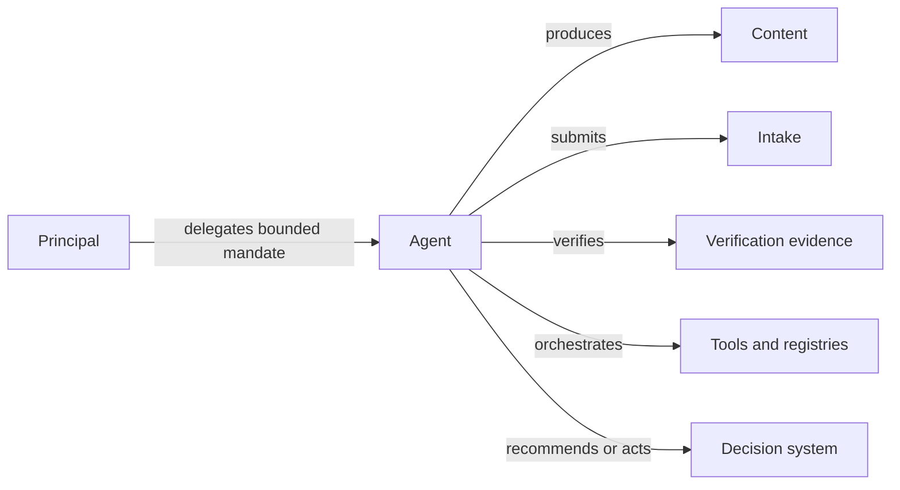
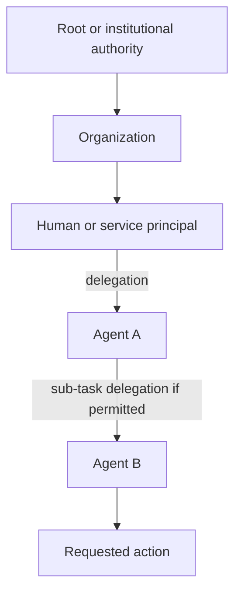

# Agent Role Model

The reference model treats an agent as a separately identifiable execution actor whose authority is derived from one or more principals. Authentication of the agent is necessary but insufficient: every governed action must bind the agent to a principal, mandate, resource, action, purpose, and decision time.

## Role separation

A deployment MAY combine roles operationally, but MUST NOT infer authority for one role from authority for another. An agent allowed to submit evidence is not thereby allowed to alter it, verify it, or adjudicate the resulting claim.

## Minimum actor model

A governed agent action SHOULD be representable with the following fields:

| Field | Meaning |
|---|---|
| `agent_id` | Stable identifier for the acting agent or service instance |
| `principal_id` | Human, organization, service, or policy authority on whose behalf the agent acts |
| `mandate_id` | Delegation or task authority relied upon |
| `action` | Specific operation requested or performed |
| `resource` | Asset, record, case, property, incident, or other object in scope |
| `purpose` | Declared purpose for the action |
| `valid_at` | Decision time at which authority is evaluated |
| `policy_epoch` | Policy version/digest used for evaluation |
| `evidence_refs` | References sufficient to replay the authority and provenance decision |

## Authority graph

Every delegation edge must be independently testable for validity, scope, temporal state, and any right to sub-delegate. A valid downstream credential cannot repair an invalid upstream mandate.

## Conformance expectations

A conforming implementation should demonstrate that:

1. agent authentication does not imply action authorization;
2. role authority is evaluated independently for producer, submitter, verifier, orchestrator, and decision actions;
3. sub-delegation is rejected unless the upstream mandate explicitly permits it;
4. revocation at any required authority edge prevents a positive authorization for the affected decision time; and
5. the resulting decision receipt identifies the agent, principal, mandate, action, resource, policy epoch, and evidence used.
