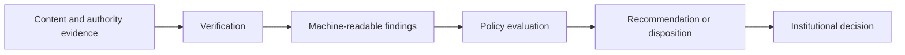

# Verification and Decision Boundaries

Agentic systems make it easy to collapse evidence verification, policy evaluation, and substantive adjudication into one opaque output. This repository keeps those boundaries explicit.

## Separation of concerns



A verifier may establish that a credential is valid, an agent mandate is in scope, a transformation was declared, or a trust source was current. It must not silently translate those findings into claims that require independent professional, legal, editorial, clinical, engineering, or factual judgment.

For example:

```yaml
credential_valid: true
agent_mandate_valid: true
producer_authority_valid: true
transformation_declared: true
```

must not be treated as equivalent to:

```yaml
underlying_claim_is_true: true
```

## Decision-agent boundary

An agent MAY recommend or execute a downstream action only where a separate mandate authorizes that decision role. A verifier role does not automatically confer approval, rejection, payment, publication, enforcement, or adjudication authority.

High-impact actions SHOULD define:

| Control | Requirement |
|---|---|
| Decision scope | Exact action the agent may recommend or execute |
| Threshold | Quantitative or qualitative bounds beyond which human/institutional review is required |
| Escalation | Explicit `review` route for ambiguity or conflict |
| Revocation | Ability to terminate future action authority |
| Corrigibility | Mechanism to reverse, supersede, or remediate erroneous actions |
| Evidence | Replayable record of inputs, mandate, policy, findings, and disposition |
| Redress | Route for an affected party to challenge the downstream action |

## Failure semantics

Agentic verification should preserve at least four governed outcomes:

- `allow`: required evidence and scope are satisfied;
- `deny`: a policy or authority rule is affirmatively violated;
- `review`: authoritative evidence conflicts or human/institutional judgment is required; and
- `indeterminate`: evidence required to make the decision is unavailable or too stale.

This prevents an autonomous system from treating uncertainty as permission.
