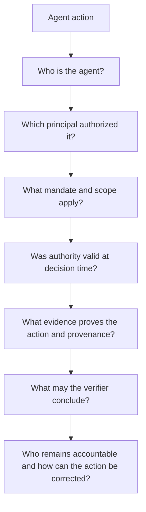

# Agentic Walkthrough Pattern

Every sector walkthrough includes an **Agentic AI Variant** derived from this pattern. The goal is to pressure-test how the existing governance decision changes when an agent acts as producer, submitter, verifier, orchestrator, proxy, or downstream decision actor.

## Required questions

Each variant should identify:

1. **Agent role** — producer, submitter, verifier, orchestrator, decision agent, or proxy.
2. **Principal** — person, organization, service, or policy authority represented by the agent.
3. **Delegated authority** — exact action the agent may perform.
4. **Scope constraints** — resource, purpose, jurisdiction, time, amount, transformation class, or other relevant limits.
5. **Agent evidence** — identifiers, task/mandate references, execution evidence, provenance, and tool/agent chain where necessary.
6. **Verification boundary** — what CAWG/C2PA and TRQP can establish.
7. **Decision boundary** — what remains an institutional or professional judgment.
8. **Revocation behavior** — what happens when principal or delegation authority changes.
9. **Human/institutional intervention** — where execution can be stopped, reviewed, corrected, or appealed.
10. **Audit evidence** — what is retained so the action can be reproduced or disputed.

## Test pattern

At minimum, an agentic scenario should test:

- authorized agent with valid mandate;
- authenticated agent without mandate;
- action or resource outside scope;
- revoked or expired delegation;
- stale or conflicting authority state;
- prohibited sub-delegation;
- correction/supersession after a material input changes; and
- a verifier result that remains bounded and does not claim substantive truth.
