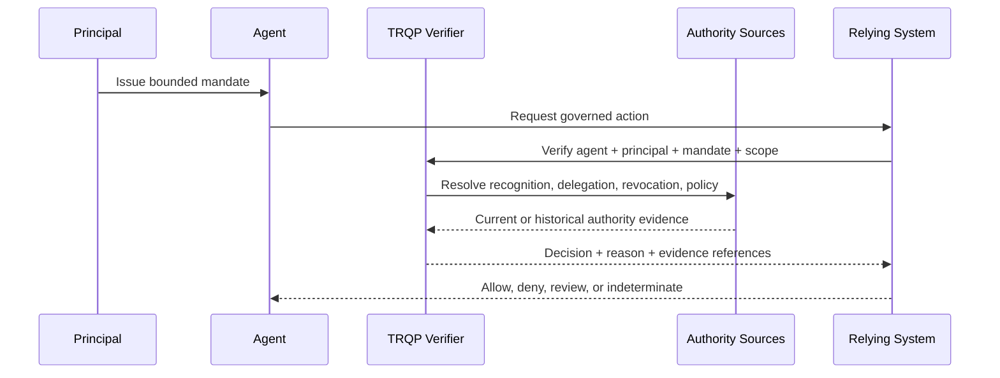

# Delegation and Authority

Agentic workflows require evidence not merely that an agent exists, but that it is authorized to perform a bounded action for a principal. The verifier therefore evaluates a **delegation chain** rather than a flat identity claim.

## Delegation tuple

For this repository, the useful abstraction is:

```text
DelegatedAction =
  AgentIdentity
  + Principal
  + Mandate
  + Action
  + ResourceScope
  + PurposeScope
  + TemporalValidity
  + DelegationDepth
  + PolicyContext
```

A positive result means the tuple satisfies the configured policy. It does not mean the content is factually true or that the downstream institution must accept the resulting claim.

## Lifecycle



## Mandatory negative states

An implementation SHOULD expose distinct non-positive outcomes for:

- agent recognized but mandate missing;
- mandate valid but action out of scope;
- resource or purpose mismatch;
- delegation expired or revoked;
- principal authority revoked;
- sub-delegation not permitted;
- trust state stale or unavailable;
- authority sources in conflict; and
- decision time outside the delegation validity interval.

These conditions must not be silently collapsed into an undifferentiated `false`, because each has different remediation and audit implications.

## Historical evaluation

Where a dispute concerns an earlier action, the verifier SHOULD support an **as-of** evaluation: was the agent authorized at the decision time? Later revocation may prevent future action without rewriting historical truth. If the underlying evidence is corrected, the implementation should issue a superseding receipt rather than overwrite the earlier decision record.

## Revocation and corrigibility

Revocation controls future authority. Corrigibility controls what happens after an action has occurred. Agentic deployments therefore need both:

- a way to revoke or narrow the mandate;
- a way to stop further execution;
- a correction path for erroneous evidence or metadata;
- a supersession model for prior receipts; and
- a redress/escalation reference for downstream institutional review.
