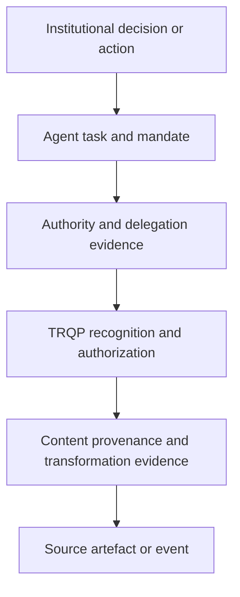

# Agentic AI Assurance

Agentic AI changes the walkthrough problem from *who produced this content?* to *which actor performed this action, for which principal, under what mandate, within what scope, and with what evidence?* This section extends the CAWG-TRQP walkthrough model so that content provenance, actor authority, delegated action, verification, and downstream institutional accountability remain separable and testable.

The governing rule is simple: **agent identity is not agent authority**. A verifier must be able to distinguish an authenticated agent from an authorized agent, and an authorized agent from an agent authorized for the specific action, resource, purpose, jurisdiction, and decision time being evaluated.

## Assurance stack

The stack preserves three independent questions:

1. **Content assurance:** what happened to the artefact?
2. **Actor and authority assurance:** who acted, for whom, and under what authority?
3. **Action and decision assurance:** was the action within mandate, and can it be reviewed, corrected, revoked, or appealed?

## Agent roles

An agent can appear in one or more roles without gaining authority from another role automatically:

| Role | Typical action | Assurance question |
|---|---|---|
| Producer | Generates or transforms content | Was this agent authorized to create or alter this artefact under the applicable transformation policy? |
| Submitter | Packages or submits evidence | Was this agent authorized by the principal to submit this resource to this recipient for this purpose? |
| Verifier | Resolves provenance, authority, or policy state | Was the agent authorized to perform verification, and are its findings reproducible from pinned evidence? |
| Orchestrator | Calls registries, tools, verifiers, or other agents | Can the full delegated action chain be reconstructed and bounded? |
| Decision agent | Recommends or executes a downstream action | Was the agent separately delegated decision authority, and are escalation/redress controls preserved? |
| Proxy | Acts on behalf of a human or organization | Is the principal-agent relationship current, scoped, and revocable? |

## Core documents

- [Agent Role Model](agent-role-model.md)
- [Delegation and Authority](delegation-and-authority.md)
- [Verification and Decision Boundaries](agentic-verification-boundaries.md)
- [Agentic Walkthrough Pattern](agentic-walkthrough-pattern.md)

## Executable archetypes

The walkthrough portfolio includes three machine-readable agentic archetypes:

- [Agent as Content Producer](../workflows/agent-content-producer.md)
- [Agent as Delegated Submitter](../workflows/agent-delegated-submitter.md)
- [Agent as Verifier and Orchestrator](../workflows/agent-verifier-orchestrator.md)

These archetypes are intentionally cross-sector. Sector walkthroughs reuse the same controls through their **Agentic AI Variant** sections.
