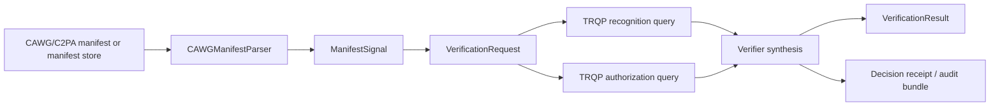

# CAWG Input Contract

This document makes the CAWG-to-TRQP handoff explicit. It describes the **implemented input contract** of this repository, not a normative amendment to either the CAWG/C2PA or TRQP specifications.

## Boundary model

The reference flow has two distinct interfaces:

1. **CAWG/C2PA extraction boundary**: a manifest parser converts a manifest or manifest-store representation into a `ManifestSignal`.
2. **TRQP verification boundary**: the extracted signal is normalized into a `VerificationRequest`, which drives recognition and authorization queries and produces a `VerificationResult`.



## Accepted CAWG-side input forms

| Input form | Detection rule | Parser mode | Status |
|---|---|---|---|
| Simplified implementation fixture | JSON object without `manifest_store` | `fixture` | Supported for tests and interoperability fixtures |
| C2PA-style manifest-store JSON | Top-level `manifest_store` object | `c2pa_json` | Supported as a JSON extraction profile |
| Binary asset with embedded C2PA data | Media file requiring a production C2PA parser | adapter-defined | Adapter boundary exists; production binary parser remains roadmap work |

## Extracted signal contract

`ManifestSignal` is the internal handoff structure produced by the CAWG parser.

| Attribute | Requirement | Type | Source or derivation | TRQP use |
|---|---|---|---|---|
| `actor_id` | Mandatory for a usable verification request | string | CAWG identity/action assertion (`actor.id`, `actor.entity_id`, or `actor_id`) | Becomes `entity_id` in authorization |
| `issuer_id` | Optional, but required when issuer recognition is evaluated | string or null | Signature information or CAWG identity assertion | Becomes `recognized_authority_id` in recognition |
| `credential_type` | Optional | string or null | CAWG identity assertion or fixture | Added to `context.credential_type` |
| `assertions` | Optional | array of objects | Active-manifest assertions | Evidence retained by parser and adapters |
| `provenance_chain` | Optional | array of strings | Ingredients and parent claims | Evidence/context for downstream profiles |
| `integrity_status` | Mandatory for conversion | string | Manifest validation result; implementation recognizes `verified` as success | Converted to `integrity_ok` |
| `action` | Mandatory for a usable request | string | CAWG action assertion or first `c2pa.actions` entry | TRQP authorization `action` |
| `resource` | Mandatory for a usable request | string | CAWG assertion/resource binding | TRQP authorization `resource` |
| `context` | Optional | object | Jurisdiction, risk tier, content type, credential type, process type, and extension values | Passed to recognition and authorization |
| `process_evidence` | Optional | object or null | Process-oriented assertion | Appraised by the verification profile |
| `parser_mode` | Generated | string | `fixture`, `c2pa_json`, or adapter-defined | Auditability and diagnostics |
| `raw_manifest` | Generated | object | Original parsed JSON | Parser/adaptor evidence; not sent by default to TRQP |

## Verification request generated from CAWG signals

The HTTP representation is defined by [`schemas/verification-request.schema.json`](../schemas/verification-request.schema.json) and the complete transport contract by [`api/openapi.json`](../api/openapi.json).

| Request attribute | Requirement | CAWG mapping | Notes |
|---|---|---|---|
| `asset_id` | Mandatory | Supplied by caller or derived from stable asset identifier | Must be a non-empty string |
| `integrity_ok` | Mandatory | `integrity_status == "verified"` after parser/validator processing | Boolean; does not itself prove authority |
| `entity_id` | Mandatory | `ManifestSignal.actor_id` | Subject of authorization query |
| `authority_id` | Mandatory | Selected trust authority / registry authority | Deployment or profile decision, not inferred blindly from content |
| `issuer_id` | Optional | `ManifestSignal.issuer_id` | Null or absent means issuer recognition cannot be positively established |
| `action` | Mandatory | `ManifestSignal.action` | Vocabulary alignment is a candidate cross-spec issue |
| `resource` | Mandatory | `ManifestSignal.resource` | Resource semantics must be agreed by profile/community |
| `context` | Optional in HTTP implementation; required by schema as an object | `ManifestSignal.context` plus caller-scoped values | Empty object is valid |
| `process_evidence` | Optional | `ManifestSignal.process_evidence` | Profile controls whether absence/failure blocks trust |
| `profile` | Optional transport control | Caller-selected built-in profile or inline profile | Defaults to `standard` |
| `overlays` | Optional transport control | Caller-selected built-in overlays | Array of overlay names |
| `use_gateway` | Optional transport control | Deployment choice | Enables gateway mediation evidence |

## Canonical CAWG-to-verifier example

```json
{
  "asset_id": "urn:asset:photo:2026-001",
  "integrity_ok": true,
  "entity_id": "did:web:creator.example:alice",
  "authority_id": "urn:trqp:authority:photography-contest",
  "issuer_id": "did:web:issuer.example",
  "action": "submit",
  "resource": "photography-contest-entry",
  "context": {
    "content_type": "image/jpeg",
    "credential_type": "CreatorCredential",
    "jurisdiction": "global",
    "risk_tier": "standard"
  },
  "process_evidence": {
    "verified": true,
    "process_type": "camera-capture",
    "evidence_format": "cawg.process.proof",
    "evidence_ref": "urn:evidence:process:001"
  },
  "profile": "standard",
  "use_gateway": false
}
```

## Validation and failure semantics

A request is rejected before policy evaluation when mandatory attributes are absent, mandatory strings are empty, `integrity_ok` is not boolean, or `context`/`process_evidence` have invalid JSON types. These failures return the common error envelope documented in the [Call Catalogue](api-call-catalogue.md).

A syntactically valid request may still produce an untrusted result. Missing issuer identity, failed recognition, denied authorization, stale policy material, revocation, descriptor failures, or inadequate process evidence are represented in `VerificationResult`; they are not transport errors.

## Specification-gap candidates exposed by this contract

The table below is deliberately framed as an issue register for CAWG and TRQP reviewers.

| Candidate gap | Why it matters | Evidence in this implementation | Proposed standards discussion |
|---|---|---|---|
| Actor identifier binding | CAWG-derived actor identity must have unambiguous TRQP subject semantics | `actor_id` becomes `entity_id` | Define identifier type/profile and binding rules |
| Issuer-to-authority recognition | A content credential issuer and a TRQP-recognized authority may not be identical concepts | `issuer_id` drives recognition | Define when issuer recognition is mandatory and which identifier is queried |
| Action vocabulary | CAWG action labels may not equal TRQP authorization actions | `action` is passed directly | Publish a controlled mapping or profile mechanism |
| Resource vocabulary | “Resource” can mean asset, workflow, role, or program | `resource` is caller/assertion supplied | Define URI-based resource typing and scoping |
| Context profile | Context is extensible but interoperability depends on shared keys and semantics | JSON object is forwarded deterministically | Establish namespaced context profiles and mandatory keys by use case |
| Integrity result provenance | Boolean `integrity_ok` compresses parser evidence | Parser produces status; request carries boolean | Define an evidence/reference structure for integrity validation |
| Process evidence semantics | Proof-of-process assertions vary in format and assurance | `process_evidence` is extensible and profile-appraised | Define minimum evidence fields and appraisal outcomes |
| Error/reason taxonomy | Cross-implementation comparison requires stable machine-readable outcomes | Implementation has result explanations and transport errors | Align reason codes across CAWG verifier and TRQP responses |

## Conformance evidence

The repository validates this boundary through parser tests, request-schema validation, HTTP integration tests, and canonical examples under `examples/api/`. The API contract validation script ensures every operation references an existing schema and example.
