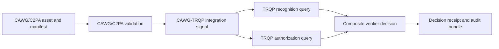
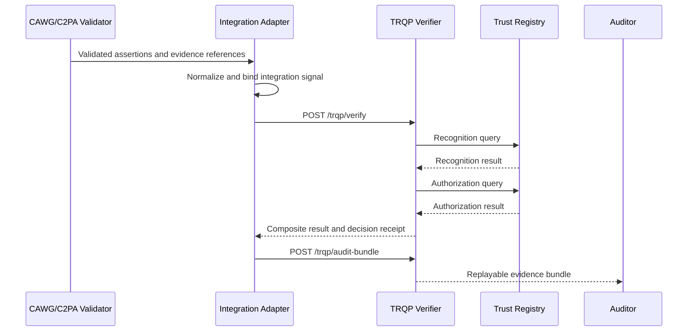

# What CAWG Must Provide to Enable TRQP Integration

This document is the repository's direct answer to the question: **What do I need to do at CAWG to enable integration with TRQP?**

It is a non-normative implementation profile and work programme. It does not amend CAWG, C2PA, or TRQP specifications. Its purpose is to make the integration boundary, required decisions, test evidence, and specification ownership explicit enough for CAWG and TRQP participants to identify and close gaps.

## Executive answer

CAWG does not need to implement TRQP. CAWG needs to ensure that a conforming CAWG/C2PA validation flow can produce a stable, typed, privacy-minimized and evidence-bound set of signals that a TRQP client can use for recognition and authorization queries.

That requires CAWG to complete five outcomes:

1. define which validated assertions identify the actor, issuer, action, resource and process evidence;
2. define deterministic extraction and vocabulary-mapping rules;
3. publish a portable integration-signal profile and canonical fixtures;
4. define how every derived field remains bound to validated manifest evidence; and
5. agree conformance and privacy requirements with TRQP implementers.

## Integration boundary and authority allocation



| Responsibility | Primary authority |
|---|---|
| Manifest authenticity, assertion validation, and provenance | C2PA/CAWG |
| Actor, issuer, action, resource, and process-signal extraction | CAWG-TRQP integration profile |
| Recognition of an issuer or authority | TRQP |
| Authorization of an actor for an action and resource | TRQP |
| Composite relying-party decision | Verifier or assurance profile |
| Evidence retention and deterministic replay | Joint integration and assurance profile |

The reference implementation must not become the accidental normative source for CAWG semantics. It demonstrates an executable mapping; standards participants retain authority over the underlying specifications.

## Minimum portable CAWG output

The machine-verifiable structure is defined by [`schemas/cawg-trqp-integration-signal.schema.json`](../schemas/cawg-trqp-integration-signal.schema.json).

```json
{
  "type": "CawgTrqpIntegrationSignal",
  "version": "0.1",
  "asset": {
    "id": "urn:asset:photo:2026-001",
    "media_type": "image/jpeg"
  },
  "validation": {
    "status": "verified",
    "validator": "c2pa-validator.example",
    "validated_at": "2026-07-20T12:00:00Z",
    "evidence_ref": "urn:evidence:c2pa-validation:001"
  },
  "actor": {
    "id": "did:web:creator.example:alice",
    "identifier_type": "did"
  },
  "issuer": {
    "id": "did:web:issuer.example",
    "identifier_type": "did"
  },
  "action": {
    "type": "submit",
    "resource": "photography-contest-entry"
  },
  "context": {
    "jurisdiction": "global",
    "credential_type": "CreatorCredential",
    "risk_tier": "standard"
  },
  "process_evidence": {
    "type": "camera-capture",
    "verified": true,
    "evidence_ref": "urn:evidence:process:001"
  }
}
```

### Attribute allocation

| Signal | CAWG baseline | Integration profile | Optional extension |
|---|---:|---:|---:|
| Asset identifier | Required |  |  |
| Manifest validation status | Required |  |  |
| Validation timestamp and evidence reference |  | Required |  |
| Typed actor identifier |  | Required |  |
| Typed issuer identifier |  | Conditional |  |
| Action |  | Required |  |
| Resource |  | Required |  |
| Namespaced context |  | Required profile keys | Additional keys |
| Process evidence |  | Profile-dependent | Yes |
| Source bindings |  | Required for audit-grade use |  |
| Raw manifest |  |  | Excluded by default |

## Decisions CAWG needs to make

| Decision | Required outcome | Evidence produced |
|---|---|---|
| Actor identifier binding | Select the assertion source, identifier types, and binding rules | Typed positive and negative fixtures |
| Issuer semantics | Distinguish credential issuer, signer, and recognized authority | Recognition mapping tests |
| Action vocabulary | Publish deterministic mappings from CAWG/C2PA actions to authorization verbs | Versioned mapping table and vectors |
| Resource semantics | Define whether the resource denotes asset, workflow, role, programme, or URI-scoped object | Resource profile and examples |
| Validation evidence | Preserve validator, status, time, and evidence reference rather than only a boolean | Schema-valid evidence envelope |
| Context profile | Define namespaced keys and mandatory keys by use case | Profile schema and compatibility declaration |
| Process evidence | Define a minimum envelope and appraisal outcomes | Process-positive and process-negative vectors |
| Reason taxonomy | Align extraction, recognition, authorization, and composite-decision outcomes | Stable machine-readable reason codes |
| Privacy minimization | Define fields permitted to leave the content-validation boundary | Data-disclosure tests |
| Source binding | Make every derived field traceable to a validated assertion or explicit caller policy | `source_bindings` evidence |

## Expected call sequence

A CAWG implementation can invoke the composite verification operation or the underlying calls independently. The preferred normal integration is `POST /trqp/verify`; direct recognition and authorization calls remain available for diagnostics, profile testing, and deployments that compose decisions externally.



See the [API Call Catalogue](api-call-catalogue.md) for the complete implemented call surface and the [OpenAPI contract](../api/openapi.json) for machine-readable request and response definitions.

## Specification ownership

| Requirement | Appropriate specification location |
|---|---|
| General creator-assertion semantics | CAWG |
| Manifest and content-credential mechanics | C2PA |
| Recognition and authorization query semantics | TRQP |
| Mapping CAWG signals into TRQP inputs | CAWG-TRQP integration profile |
| Composite trust decision rules | Verifier or assurance profile |
| HTTP endpoints and deployment mechanics | Reference implementation |
| Evidence retention, replay, and assurance claims | Joint assurance profile |

## Conformance and readiness gates

CAWG-side integration readiness is reached only when the following can be tested:

1. the same valid manifest produces the same normalized integration signal;
2. actor, issuer, action, resource and process fields remain traceable to validated assertions;
3. identifiers are typed and unambiguous;
4. absent or ambiguous mandatory fields produce defined failures;
5. action and resource mappings are deterministic and versioned;
6. raw manifests and unrelated personal data are not sent to TRQP by default;
7. every TRQP input can be traced to content evidence or an explicit caller policy parameter;
8. tampered, conflicting, revoked and unsupported assertions produce stable outcomes;
9. audit bundles identify the integration-profile and transformation versions used; and
10. unsupported integration-signal versions fail explicitly.

The machine-readable readiness register is [`conformance/cawg-trqp-readiness-matrix.yaml`](../conformance/cawg-trqp-readiness-matrix.yaml). Canonical positive and negative vectors are under [`examples/cawg-trqp/`](../examples/cawg-trqp/).

## CAWG work programme

| ID | Work item | Deliverable | Acceptance evidence |
|---|---|---|---|
| CAWG-TRQP-01 | Approve the integration boundary | Architecture decision and responsibility matrix | Published decision record |
| CAWG-TRQP-02 | Define actor and issuer extraction | Identifier profile | Positive and negative fixtures |
| CAWG-TRQP-03 | Define action and resource mappings | Versioned vocabulary mapping | Mapping tests |
| CAWG-TRQP-04 | Define validation-evidence envelope | JSON Schema | Schema validation |
| CAWG-TRQP-05 | Define process-evidence minimums | Assertion or profile text | Process vectors |
| CAWG-TRQP-06 | Define privacy rules | Data-minimization profile | Disclosure tests |
| CAWG-TRQP-07 | Publish integration-signal profile | Versioned schema | Independent implementation validation |
| CAWG-TRQP-08 | Publish canonical vectors | Fixture package | Cross-implementation results |
| CAWG-TRQP-09 | Align reason codes | Joint taxonomy | Comparative tests |
| CAWG-TRQP-10 | Run interoperability testing | Test report | At least two independent implementations |

## Definition of done

CAWG enablement is complete when a CAWG/C2PA validator from one implementation can produce a schema-valid integration signal, a separately implemented TRQP client can consume it without private field knowledge, and both parties can reproduce the resulting recognition, authorization, composite-decision and evidence outcomes from published fixtures.
