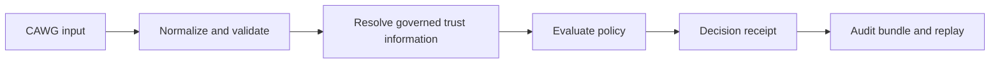

# Guided Learning Paths

This repository is best understood as a decision-to-evidence system. A CAWG input is evaluated against governed trust information and policy, producing a decision receipt and replayable assurance evidence. Choose the route that matches the outcome you own.

## Route 1: industry body or programme sponsor

1. [Non-technical overview](NON_TECHNICAL_OVERVIEW.md)
2. [Industry-body decision brief](industry-adoption/industry-body-decision-brief.md)
3. [CAWG implementation playbook](industry-adoption/cawg-implementation-playbook.md)
4. [Pilot blueprint](industry-adoption/music-industry-pilot-blueprint.md)

**Completion test:** the sponsoring body can identify governance authority, pilot scope, recognition rules, operator obligations, evidence custody, decision rights and exit criteria.

## Route 2: integration engineer

1. [Quickstart](../QUICKSTART.md)
2. [Architecture](architecture.md)
3. [CAWG input contract](cawg-input-contract.md)
4. [Decision receipt specification](decision-receipt-specification.md)
5. [Integration guide](INTEGRATION_GUIDE.md)
6. [API call catalogue](api-call-catalogue.md)

**Completion test:** a representative CAWG assertion can be processed end to end and yields a deterministic, schema-valid receipt.

## Route 3: production operator or assurance reviewer

1. [Deployment guide](deployment-guide.md)
2. [Operational hardening](operational-hardening.md)
3. [Threats and risks](threats-and-risks/index.md)
4. [Privacy and personal information](privacy/index.md)
5. [Audit bundle profile](audit-bundle-profile.md)
6. [Reproducibility guide](reproducibility-guide.md)

**Completion test:** an independent party can determine which authority and policy were used, reproduce the decision, inspect freshness and revocation state, and assign residual risk.

## Evidence checkpoint

At every transition preserve the input digest, trust-source identity and freshness, policy identifier, evaluation result, receipt signature or integrity mechanism, and replay dependencies. A result without this chain is an assertion, not assurance evidence.

[Continue to the documentation architecture →](documentation-architecture.md)
