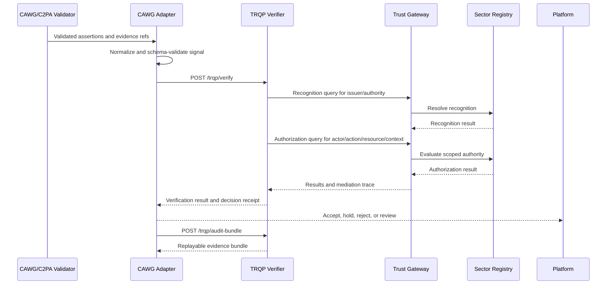

# CAWG Implementation Playbook for Sector Integration

This is the fastest implementation path for a CAWG team wiring a complete sector workflow into TRQP. It identifies what must be undertaken in CAWG processing, what belongs outside CAWG, the calls to make, and the evidence that proves the integration works.

## Outcome to deliver

A conforming CAWG/C2PA validation pipeline must emit a portable, typed, privacy-minimized, evidence-bound signal that can be converted deterministically into TRQP recognition and authorization requests.

```mermaid
flowchart LR
    A[Asset and CAWG/C2PA manifest] --> B[Validate manifest and assertions]
    B --> C[Select sector profile]
    C --> D[Extract actor and issuer]
    D --> E[Map action and resource]
    E --> F[Populate context]
    F --> G[Create source bindings]
    G --> H[Validate integration signal]
    H --> I[POST /trqp/verify]
    I --> J[Decision receipt]
    J --> K[Audit bundle and replay]
```



## What CAWG must undertake

### 1. Define the extraction contract

CAWG must specify which validated assertion supplies each downstream field. Implementers must not infer actor, issuer, action, or resource differently across products.

| Integration field | CAWG decision required |
|---|---|
| Actor | Which assertion identifies the acting or submitting party? |
| Issuer | How are signer, credential issuer, label, and recognized authority distinguished? |
| Action | Which CAWG/C2PA action maps to the sector authorization verb? |
| Resource | What object is the authorization about: recording, catalogue, voice, claim, or workflow? |
| Context | Which use-case keys are mandatory and namespaced? |
| Process evidence | Which process assertions are carried and how are they appraised? |
| Source binding | How is each derived value traced to validated manifest evidence? |

### 2. Publish deterministic mappings

For the music-distribution pilot, a mapping table should be versioned and tested.

| CAWG-side semantic | Normalized field | Example |
|---|---|---|
| Submitting organization identity | `actor.id` | `did:web:distributor.example` |
| Label or authorization issuer | `issuer.id` | `did:web:label.example` |
| Delivery/distribution assertion | `action.type` | `distribute` |
| Recording identifier | `action.resource` | `isrc:US-ABC-26-00001` |
| Intended territory | `context.territory` | `US` |
| Destination service | `context.platform` | `pilot-streaming-service` |
| Effective authorization period | `context.effective_from` / `effective_until` | RFC 3339 timestamps |

Mappings must fail explicitly when a value is absent, ambiguous, unsupported, or conflicts with another validated assertion.

### 3. Emit the integration signal

Use [`schemas/cawg-trqp-integration-signal.schema.json`](../../schemas/cawg-trqp-integration-signal.schema.json). A sector implementation should validate the signal before any network call.

```json
{
  "type": "CawgTrqpIntegrationSignal",
  "version": "0.1",
  "asset": {
    "id": "isrc:US-ABC-26-00001",
    "media_type": "audio/flac"
  },
  "validation": {
    "status": "verified",
    "validator": "c2pa-validator.example",
    "validated_at": "2026-08-01T10:30:00Z",
    "evidence_ref": "urn:evidence:c2pa:music-00001"
  },
  "actor": {
    "id": "did:web:distributor.example",
    "identifier_type": "did"
  },
  "issuer": {
    "id": "did:web:label.example",
    "identifier_type": "did"
  },
  "action": {
    "type": "distribute",
    "resource": "isrc:US-ABC-26-00001"
  },
  "context": {
    "profile": "recorded-music-distribution-v1",
    "territory": "US",
    "platform": "pilot-streaming-service",
    "effective_at": "2026-08-01T10:30:00Z"
  },
  "source_bindings": [
    {"field": "actor.id", "assertion_ref": "cawg.assertion.distributor"},
    {"field": "issuer.id", "assertion_ref": "cawg.assertion.label"},
    {"field": "action.resource", "assertion_ref": "c2pa.assertion.metadata"}
  ]
}
```

## Call wiring

The preferred production-style path is the composite verification call. Separate recognition and authorization calls remain useful for diagnostics and external orchestration.



### Required calls

| Call | When to use | CAWG-derived inputs |
|---|---|---|
| `POST /trqp/verify` | Normal end-to-end integration | actor, issuer, action, resource, context, validation evidence references |
| `POST /trqp/recognition` | Diagnostic or externally composed flow | issuer or authority identifier and context |
| `POST /trqp/authorization` | Diagnostic or externally composed flow | actor, action, resource, authority, context |
| `POST /trqp/gateway/authorization` | Federated registry deployment | same authorization inputs plus routing authority |
| `POST /trqp/audit-bundle` | Audit, appeal, replay, or regulated evidence retention | complete verification request and pinned evidence |

See the [API Call Catalogue](../api-call-catalogue.md) and [OpenAPI contract](../../api/openapi.json) for the complete wire contract.

## Mandatory CAWG failure behavior

CAWG adapters must not silently manufacture missing policy inputs.

| Condition | Required outcome |
|---|---|
| Manifest or assertion validation failed | Do not issue a trusted integration signal |
| Actor missing | Reject signal as incomplete |
| Multiple unresolved actors | Reject as ambiguous |
| Issuer required by profile but absent | Reject or return profile-defined indeterminate state |
| Action mapping unavailable | Reject as unsupported vocabulary |
| Resource not bound to validated evidence | Reject as unbound |
| Required context missing | Reject as profile incomplete |
| Unsupported profile version | Fail explicitly |
| Raw personal or commercial data not required | Exclude from TRQP request |

## What CAWG does not own

CAWG should define validated assertion semantics and deterministic extraction. It should not define TRQP recognition policy, registry authority, relying-party acceptance decisions, or sector appeal rules. Those belong to the joint integration profile, TRQP governance, and the relying party.

## Implementation evidence checklist

A CAWG implementation is ready for integration when it can produce:

- a schema-valid integration signal;
- field-level source bindings;
- deterministic mapping-version metadata;
- positive and negative extraction fixtures;
- explicit missing and ambiguous-field outcomes;
- minimized TRQP requests;
- stable reason codes;
- a successful `/trqp/verify` exchange;
- a decision receipt containing policy and evidence provenance;
- an audit bundle that independently replays.

## Minimum test matrix

| Test | Expected evidence |
|---|---|
| Valid label/distributor/recording | Authorized result and receipt |
| Unknown distributor | Unknown result, not an infringement assertion |
| Revoked authorization | Revoked result with current revocation evidence |
| Territory mismatch | Scope-mismatch reason code |
| Platform mismatch | Scope-mismatch reason code |
| Expired authority | Expired result |
| Ambiguous issuer | Integration-signal rejection before TRQP call |
| Tampered manifest | CAWG validation failure and no trusted handoff |
| Registry unavailable | Profile-defined fail-closed, deferred, or indeterminate result |
| Replay | Audit bundle reproduces the recorded outcome |

The canonical pilot fixtures are under [`examples/music-industry/`](../../examples/music-industry/) and readiness gates under [`conformance/music-industry-pilot-readiness.yaml`](../../conformance/music-industry-pilot-readiness.yaml).
