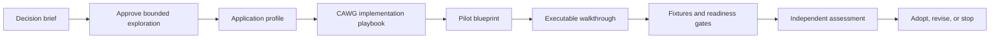

# Industry Adoption

This section shows how a sector governance organization can turn the CAWG-TRQP reference architecture into a bounded, testable industry programme.

The examples use recorded music because it exposes the core governance problem clearly: valid provenance can show where an asset and its assertions came from, but a relying party still needs to determine whether the identified actor was recognized and authorized to perform a specific action.

The material is illustrative and non-normative. References to RIAA, IMI, labels, distributors, platforms, or other organizations do not imply endorsement, participation, formal authority, or adoption.

## Choose your path

| You are... | Start with | Outcome |
|---|---|---|
| An industry-body executive or board member | [Industry Body Decision Brief](industry-body-decision-brief.md) | Understand the institutional proposition, limits, and decision requested |
| A programme sponsor | [Music-Industry Pilot Blueprint](music-industry-pilot-blueprint.md) | Approve and govern a bounded pilot |
| A CAWG implementer or specification editor | [CAWG Implementation Playbook](cawg-implementation-playbook.md) | See exactly what CAWG must emit, bind, test, and hand to TRQP |
| A sector architect or policy designer | [Music-Industry Application Profile](music-industry-application-profile.md) | Define sector actions, resources, contexts, authority, and revocation |
| An integration engineer | [Authorized Music Distribution Walkthrough](../workflows/authorized-music-distribution.md) | Wire the complete end-to-end workflow |

## Decision-to-deployment path

## Demonstrated, profiled, and future

| Status | Meaning |
|---|---|
| **Demonstrated** | Recognition, authorization, gateway mediation, cache/freshness controls, decision receipts, audit bundles, schemas, and replay are implemented in this repository |
| **Profiled** | Music-sector actions, resources, context keys, authority relationships, and pilot outcomes are proposed as non-normative examples |
| **Pilot-dependent** | Authoritative registries, sector adoption, international recognition, performer-consent services, and production deployment require institutional agreement and implementation |
