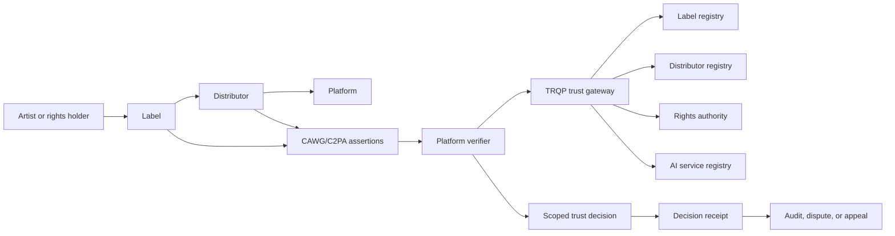

# Applying CAWG-TRQP to Recorded-Music Trust Decisions

This document is a non-normative sector application profile. It translates the generic CAWG-to-TRQP integration boundary into candidate recorded-music actors, actions, resources, contexts, and governance decisions.

## Architecture



## Authority allocation

| Question | Authority |
|---|---|
| Was the asset and its assertion set validated? | CAWG/C2PA validator |
| Which actor, issuer, action, and resource were extracted? | CAWG integration profile and adapter |
| Is the issuer or registry recognized? | TRQP recognition policy |
| Is the actor authorized for the requested action and resource? | TRQP authorization policy |
| Should the platform accept, hold, or reject? | Platform/verifier profile |
| Can the decision be replayed and challenged? | Assurance and appeal profile |

## Candidate decision patterns

### Distribution authority

> Is actor X authorized by issuer Y to distribute recording Z to service S in territory T during period P?

### AI-use declaration authority

> Is actor X recognized and authorized to classify recording Z under AI-use profile P?

### Voice or likeness use

> Is actor X authorized to use performer Y's voice or likeness for recording Z, purpose P, territory T, and duration D?

### Licensing authority

> Is actor X recognized as authorized to license resource Z for use U in territory T?

### Enforcement authority

> Is notifier X recognized and authorized to submit an enforcement request concerning repertoire R?

### Service-provider accreditation

> Was service X recognized for function F at the time it was used?

## Candidate vocabularies

These terms are pilot semantics, not standards text.

### Actions

```yaml
actions:
  - distribute
  - deliver_to_platform
  - classify_ai_use
  - use_voice_replica
  - license
  - issue_enforcement_notice
  - attest_metadata
  - certify_service
```

### Resource types

```yaml
resource_types:
  - sound_recording
  - audiovisual_recording
  - catalogue
  - artist_voice
  - artist_likeness
  - metadata_record
  - rights_claim
  - enforcement_case
```

### Context dimensions

```yaml
context:
  - territory
  - platform
  - purpose
  - effective_from
  - effective_until
  - release_type
  - rights_category
  - ai_usage_classification
  - delegation_allowed
  - assurance_level
```

## CAWG output required by this profile

CAWG-side processing must produce a stable integration signal before TRQP is invoked.

| Field | CAWG responsibility | TRQP use |
|---|---|---|
| `asset.id` | Extract or derive a stable asset identifier and bind it to the validated manifest | Resource scoping and audit correlation |
| `validation.*` | Preserve validation status, validator, time, and evidence reference | Trusts only validated source evidence |
| `actor` | Extract a typed submitting or acting party identifier | Authorization subject |
| `issuer` | Extract a typed authority, label, or credential issuer when present | Recognition and delegation chain |
| `action.type` | Map the CAWG/C2PA assertion to a versioned sector verb | Authorization predicate |
| `action.resource` | Bind the action to a recording, catalogue, or other scoped object | Authorization resource |
| `context` | Populate required sector keys such as territory and platform | Policy evaluation scope |
| `source_bindings` | Link every derived field to a validated assertion or explicit caller policy | Auditability and dispute resolution |

CAWG implementers should use the [CAWG Implementation Playbook](cawg-implementation-playbook.md) and the generic [CAWG-to-TRQP Integration Enablement](../cawg-trqp-integration-enablement.md) guide together.

## Decision outcomes

| Outcome | Meaning | Recommended relying-party action |
|---|---|---|
| Authorized | Current authority matches the requested scope | Continue processing |
| Scope mismatch | Authority exists, but not for this territory, platform, resource, or time | Hold and request correction |
| Unknown | No recognized result exists | Request additional evidence |
| Expired | Authority has ended | Reject or hold under policy |
| Revoked | Authority was expressly withdrawn | Reject and preserve evidence |
| Conflicting | Incompatible issuers or claims exist | Quarantine and escalate |
| Stale | Freshness threshold has been exceeded | Re-query or downgrade confidence |
| Unavailable | Authoritative service cannot be reached | Apply documented failure policy |
| Invalid evidence | CAWG/C2PA validation or binding failed | Forensic or manual review |

## Privacy and commercial confidentiality

The TRQP request should contain only the attributes needed to decide the scoped authorization question. Raw manifests, contracts, royalty data, personal contact information, and unrelated rights metadata should not be sent by default. Evidence references and digests should be preferred where complete data disclosure is unnecessary.

## Profile completion criteria

The profile is ready for a pilot only when:

- the actor and issuer identifier types are agreed;
- the `distribute` action is unambiguous;
- recording and catalogue resources are represented consistently;
- territory, platform, time, and delegation context are mandatory where applicable;
- revocation and expiry behavior are defined;
- reason codes are stable;
- positive, negative, stale, revoked, and conflicting fixtures exist;
- the complete workflow produces a replayable decision receipt.
