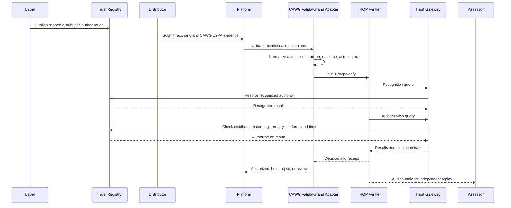

# Authorized Digital Music Delivery Pilot

## Pilot question

Can a participating platform determine, through an interoperable and replayable process, whether a distributor is authorized by a recognized label to deliver a specific recording or catalogue?

## Pilot scope

The pilot is limited to distribution authority. It does not attempt to determine complete copyright ownership, royalty entitlement, composition rights, performer consent, or enforcement authority.

## Participants and delegation

| Participant | Authority and responsibility |
|---|---|
| Industry body | Convene the pilot, approve governance, recognition, assurance, and appeal rules |
| Participating labels | Issue scoped distributor authorizations |
| Participating distributors | Submit assets and bound provenance evidence |
| Digital platform | Make the final accept, hold, or reject decision |
| Trust-registry operator | Publish recognition and authorization state |
| Trust-gateway operator | Route queries and produce mediation evidence |
| CAWG implementation team | Define and implement deterministic assertion extraction and handoff |
| Independent assessor | Validate conformance, replay, governance, privacy, and operational evidence |

## End-to-end pilot



## Phase plan

### Phase 1: Governance design

Produce:

- pilot charter;
- authority and responsibility matrix;
- registry and gateway operator appointments;
- recognition policy;
- revocation and expiry policy;
- privacy and evidence-retention policy;
- appeal and correction procedure;
- risk register and stop criteria.

### Phase 2: CAWG integration profile

The CAWG team must complete:

- actor and issuer assertion selection;
- typed identifier profile;
- deterministic `distribute` action mapping;
- recording and catalogue resource mapping;
- required context keys;
- source-binding method;
- missing, ambiguous, and conflicting evidence behavior;
- canonical positive and negative fixtures.

The implementation detail is in the [CAWG Implementation Playbook](cawg-implementation-playbook.md).

### Phase 3: TRQP and registry wiring

Complete:

- recognition records for pilot authorities;
- scoped distributor authorization records;
- trust-gateway routes;
- cache and freshness policy;
- revocation feed;
- reason-code alignment;
- decision receipt and audit-bundle configuration.

### Phase 4: Controlled execution

Exercise:

- positive authorization;
- unknown distributor;
- incorrect territory;
- incorrect platform;
- expired authority;
- revoked authority;
- ambiguous issuer;
- unavailable registry;
- stale cached result;
- tampered provenance evidence;
- successful appeal and correction.

### Phase 5: Independent assessment

The assessor should produce:

- conformance report;
- interoperability report;
- privacy and minimization findings;
- governance and authority findings;
- operational performance evidence;
- appeal and redress findings;
- residual-risk register;
- recommendation to adopt, revise, extend, or stop.

## Decision states

| State | Meaning | Platform action |
|---|---|---|
| Authorized | Current authority matches the requested scope | Continue ingestion |
| Scope mismatch | Authority exists outside requested scope | Hold |
| Unknown | No recognized result | Request evidence |
| Expired | Authority ended | Reject or hold |
| Revoked | Authority expressly withdrawn | Reject |
| Conflicting | Incompatible claims or issuers | Quarantine |
| Stale | Freshness threshold exceeded | Re-query |
| Unavailable | Authoritative service unreachable | Apply failure policy |
| Invalid evidence | CAWG/C2PA validation or binding failed | Forensic review |

## Success criteria

The pilot succeeds only if:

- two independent implementations reach consistent outcomes on canonical vectors;
- CAWG extraction is deterministic and evidence-bound;
- no authorization leaks across labels, platforms, territories, or resources;
- expiry and revocation are enforced within the agreed freshness budget;
- unknown and indeterminate states are not misrepresented as infringement;
- reason codes are understandable to operators;
- privacy-minimized requests are sufficient for policy evaluation;
- audit bundles replay successfully;
- appeals can correct erroneous or stale decisions;
- performance and cache behavior are measured rather than assumed.

## Stop criteria

Stop or redesign the pilot when:

- authority cannot be scoped unambiguously;
- source bindings cannot be preserved;
- participants cannot agree recognition or revocation authority;
- required data disclosure is disproportionate;
- decisions cannot be independently replayed;
- appeals cannot restore wrongly denied actors;
- technical results are used as conclusive legal determinations.

## Required evidence package

The final pilot package should include:

```text
governance charter
responsibility matrix
application profile
CAWG extraction contract
OpenAPI compatibility statement
positive and negative fixtures
registry and gateway configuration
cache and freshness policy
conformance report
performance evidence
sample decision receipts
audit bundles and replay report
appeal simulation record
residual-risk register
```
