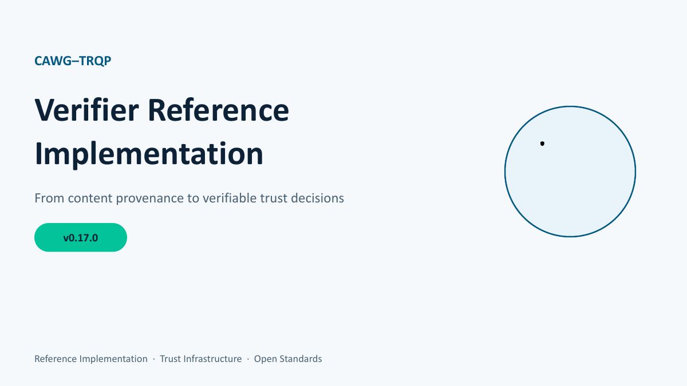

# CAWG-TRQP Explainer Presentation
{: .fs-9 }

A concise, presentation-ready explanation of how this reference implementation
connects CAWG/C2PA content provenance to TRQP-backed authorization,
recognition, decision receipts, and replayable audit evidence.
{: .fs-6 .fw-300 }

[Open the presentation](../assets/presentations/cawg-trqp-explainer-v2.pdf){: .btn .btn-primary .fs-5 .mb-4 .mb-md-0 .mr-2 }
[CAWG Input Contract](cawg-input-contract.md){: .btn .fs-5 .mb-4 .mb-md-0 .mr-2 }
[API Call Catalogue](api-call-catalogue.md){: .btn .fs-5 .mb-4 .mb-md-0 }

## Artifact status

| Attribute | Value |
|---|---|
| Presentation | CAWG-TRQP Verifier Reference Implementation: From content provenance to verifiable trust decisions |
| Presentation version | v2 |
| Implementation version represented | v0.17.0 |
| Format | PDF, 15 slides |
| Status | Explanatory, non-normative |
| Canonical asset | `assets/presentations/cawg-trqp-explainer-v2.pdf` |
| Integrity metadata | `assets/presentations/manifest.json` |

{: .important }
The presentation is an explanatory adoption artifact. The implementation,
JSON Schemas, OpenAPI contract, profiles, and normative upstream specifications
remain authoritative when wording or examples differ.

## How to use the presentation

Use the deck as the ten-minute orientation layer before moving into executable
contracts and examples. It is especially useful for standards reviewers,
architects, policy owners, and contributors who need the complete system model
before examining individual calls.

The deck intentionally moves through four layers:

1. **Problem and standards boundary** - why valid signatures do not establish
   authorization, and how CAWG/C2PA and TRQP occupy different parts of the
   verification problem.
2. **Execution architecture** - the verifier pipeline, deployment profiles,
   trust gateway, and process-aware verification model.
3. **Evidence and assurance** - decision receipts, audit bundles, replay, and
   cross-repository assurance outputs.
4. **Adoption and roadmap** - intended audiences, implementation history,
   future work, and contributor entry points.

## Slide-by-slide documentation map

| Slides | Topic | Authoritative repository documentation |
|---|---|---|
| 2-3 | Problem statement and CAWG/C2PA-to-TRQP boundary | [Non-Technical Overview](NON_TECHNICAL_OVERVIEW.md), [TRQP Alignment](trqp-alignment.md) |
| 4 | Portfolio stack and accountable outputs | [TRQP Adoption Path](trqp-adoption-path.md), [Assurance Suite Ingestion](assurance-suite-ingestion.md) |
| 5 | Reference implementation scope and guarantees | [Architecture](architecture.md), [How TRQP Enables Assurance](how-trqp-enables-assurance.md) |
| 6 | Manifest-to-decision pipeline | [CAWG Input Contract](cawg-input-contract.md), [Parser Adapter Contract](parser-adapter-contract.md), [Integration Guide](INTEGRATION_GUIDE.md) |
| 7 | Edge, standard, and high-assurance profiles | [Verifier Profiles](verifier-profiles.md), [Descriptor Policy](descriptor-policy.md) |
| 8 | Decision receipts and audit bundles | [Decision Receipt Specification](decision-receipt-specification.md), [Audit Bundle Profile](audit-bundle-profile.md), [Reproducibility Guide](reproducibility-guide.md) |
| 9 | Trust gateway and policy routing | [Trust Gateway](trust-gateway.md), [HTTP Transport Patterns](http-transport-patterns.md) |
| 10 | Process-aware verification | [Implementation Notes](implementation-notes.md), [Risk Crosswalk](risk-crosswalk.md) |
| 11-12 | Interoperability and stakeholder relevance | [Interoperability Vectors](interoperability-vectors.md), [Compatibility Matrix](compatibility-matrix.md) |
| 13 | Roadmap and deferred work | [Roadmap](../ROADMAP.md) |
| 14 | Running and contributing | [Quickstart](../QUICKSTART.md), [Contributing](../CONTRIBUTING.md) |

## Interface review companion

For CAWG and TRQP specification review, the presentation should be read with
these implementation-grade artifacts:

- [CAWG Input Contract](cawg-input-contract.md) defines the accepted input
  shapes, source mappings, mandatory and optional attributes, validation
  semantics, and candidate specification gaps.
- [API Call Catalogue](api-call-catalogue.md) enumerates every implemented
  input, output, and error surface.
- [`api/openapi.json`](../api/openapi.json) is the machine-readable OpenAPI 3.1
  contract for the HTTP service.
- Canonical payloads in `examples/api/` provide schema-validated request and
  response examples suitable for interoperability review.

## Embedded viewer

Most browsers can display the presentation below. Use the **Open the
presentation** button above when embedded PDF viewing is unavailable.

  <iframe
    src="{{ '/assets/presentations/cawg-trqp-explainer-v2.pdf' | relative_url }}"
    title="CAWG-TRQP verifier reference implementation explainer presentation"
    width="100%"
    height="720"
    loading="lazy">
  </iframe>

## Maintenance policy

Update or replace the presentation when a release changes any of the following:

- the implementation version displayed in the deck;
- the public API or CAWG input contract;
- verifier profile semantics;
- evidence artifacts or replay guarantees;
- the cross-repository stack or maturity status;
- roadmap claims presented as current capability.

A replacement must update the PDF, cover image, manifest checksum, this page,
and the validation evidence in the same commit. Historical decks should be
retained only when they are deliberately published as versioned release
artifacts.
