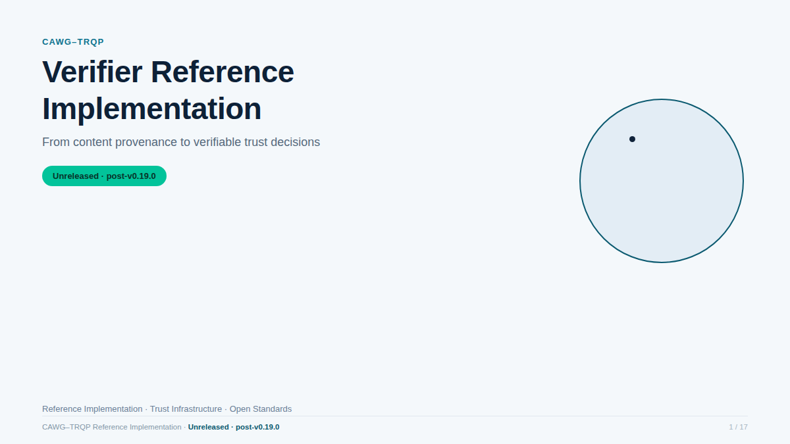

# CAWG-TRQP Explainer Presentation
{: .fs-9 }

A concise, presentation-ready explanation of how this reference implementation
connects CAWG/C2PA content provenance to TRQP-backed authorization,
recognition, decision receipts, agentic AI assurance, and replayable audit
evidence.
{: .fs-6 .fw-300 }

[Open the presentation](../assets/presentations/cawg-trqp-explainer-v3.pdf){: .btn .btn-primary .fs-5 .mb-4 .mb-md-0 .mr-2 }
[CAWG Input Contract](cawg-input-contract.md){: .btn .fs-5 .mb-4 .mb-md-0 .mr-2 }
[API Call Catalogue](api-call-catalogue.md){: .btn .fs-5 .mb-4 .mb-md-0 }

## Artifact status

| Attribute | Value |
|---|---|
| Presentation | CAWG-TRQP Verifier Reference Implementation: From content provenance to verifiable trust decisions |
| Presentation version | v3 |
| Implementation state represented | Unreleased, post-v0.19.0 (current repository `HEAD`) |
| Format | PDF, 17 slides |
| Status | Explanatory, non-normative |
| Canonical asset | `assets/presentations/cawg-trqp-explainer-v3.pdf` |
| Integrity metadata | `assets/presentations/manifest.json` |
| Superseded artifact | `assets/presentations/cawg-trqp-explainer-v2.pdf` (retained as the v0.19.0 release-tagged historical deck) |

{: .important }
The presentation is an explanatory adoption artifact. The implementation,
JSON Schemas, OpenAPI contract, profiles, and normative upstream specifications
remain authoritative when wording or examples differ.

## Why v3

v2 was pinned to the v0.19.0 release. Since that release, the repository has
added a cross-cutting Agentic AI Assurance model, grown the walkthrough
portfolio to twenty-one scenarios (eighteen sector walkthroughs, each with an
Agentic AI Variant, plus three cross-sector agentic archetypes), and shipped a
full adversarial threat-model and privacy/personal-information governance
package. v2 predates all of this and undercounts the current walkthrough
portfolio and capability surface. v3 replaces it as the canonical deck and is
explicitly versioned against the unreleased `HEAD` state rather than a stale
release tag, so it stops drifting silently between releases.

## How to use the presentation

Use the deck as the ten- to twelve-minute orientation layer before moving
into executable contracts and examples. It is especially useful for standards
reviewers, architects, policy owners, and contributors who need the complete
system model before examining individual calls.

The deck moves through five layers:

1. **Problem and standards boundary** - why valid signatures do not establish
   authorization, and how CAWG/C2PA and TRQP occupy different parts of the
   verification problem.
2. **Execution architecture** - the verifier pipeline, deployment profiles,
   trust gateway, and process-aware verification model.
3. **Evidence and assurance** - decision receipts, semantic assurance
   controls, audit bundles, and replay.
4. **Agentic AI, portfolio, and risk governance** - the agent role model, the
   twenty-one-scenario walkthrough portfolio, and the threat-model/privacy
   governance package.
5. **Interoperability, validation, roadmap, and adoption** - cross-repository
   review artifacts, machine-checked validation evidence, deferred work, and
   contributor entry points.

## Slide-by-slide documentation map

| Slides | Topic | Authoritative repository documentation |
|---|---|---|
| 2 | Problem statement | [Non-Technical Overview](NON_TECHNICAL_OVERVIEW.md) |
| 3 | CAWG/C2PA-to-TRQP standards boundary | [TRQP Alignment](trqp-alignment.md), [PROJECT-STATUS.yaml](../PROJECT-STATUS.yaml) |
| 4 | Portfolio stack and accountable outputs | [TRQP Adoption Path](trqp-adoption-path.md), [Assurance Suite Ingestion](assurance-suite-ingestion.md) |
| 5 | Reference implementation scope and guarantees | [Architecture](architecture.md), [How TRQP Enables Assurance](how-trqp-enables-assurance.md) |
| 6 | Manifest-to-decision pipeline | [CAWG Input Contract](cawg-input-contract.md), [Parser Adapter Contract](parser-adapter-contract.md), [Integration Guide](INTEGRATION_GUIDE.md) |
| 7 | Edge, standard, and high-assurance profiles | [Verifier Profiles](verifier-profiles.md), [Descriptor Policy](descriptor-policy.md) |
| 8 | Decision receipts, semantic assurance, and audit bundles | [Decision Receipt Specification](decision-receipt-specification.md), [Audit Bundle Profile](audit-bundle-profile.md), [Reproducibility Guide](reproducibility-guide.md) |
| 9 | Trust gateway and policy routing | [Trust Gateway](trust-gateway.md), [HTTP Transport Patterns](http-transport-patterns.md) |
| 10 | Agentic AI assurance model | [Agentic AI Assurance](agentic-ai/index.md), [Agent Role Model](agentic-ai/agent-role-model.md), [Delegation and Authority](agentic-ai/delegation-and-authority.md) |
| 11 | Walkthrough portfolio (21 scenarios) | [Walkthroughs index](sections/walkthroughs-index.md) |
| 12 | Threat model and privacy governance | [Threats and Risks](threats-and-risks/index.md), [Privacy and Personal Information](privacy/index.md) |
| 13 | Interoperability and compatibility | [Interoperability Vectors](interoperability-vectors.md), [Compatibility Matrix](compatibility-matrix.md) |
| 14 | Validation and evidence | [Documentation Quality Standard](documentation-quality-standard.md), `Makefile` |
| 15 | Roadmap and deferred work | [Roadmap](../ROADMAP.md), [CHANGELOG](../CHANGELOG.md) |
| 16 | Running and contributing | [Quickstart](../QUICKSTART.md), [Contributing](../CONTRIBUTING.md) |
| 17 | Closing and adoption links | [GOVERNANCE.md](../GOVERNANCE.md), [PROJECT-STATUS.yaml](../PROJECT-STATUS.yaml) |

## Interface review companion

For CAWG and TRQP specification review, the presentation should be read with
these implementation-grade artifacts:

- [CAWG Input Contract](cawg-input-contract.md) defines the accepted input
  shapes, source mappings, mandatory and optional attributes, validation
  semantics, and candidate specification gaps.
- [API Call Catalogue](api-call-catalogue.md) enumerates every implemented
  input, output, and error surface.
- [`api/openapi.json`](../api/openapi.json) is the machine-readable OpenAPI 3.1
  contract for the HTTP service.
- Canonical payloads in `examples/api/` provide schema-validated request and
  response examples suitable for interoperability review.

## Embedded viewer

Most browsers can display the presentation below. Use the **Open the
presentation** button above when embedded PDF viewing is unavailable.

  <iframe
    src="{{ '/assets/presentations/cawg-trqp-explainer-v3.pdf' | relative_url }}"
    title="CAWG-TRQP verifier reference implementation explainer presentation"
    width="100%"
    height="720"
    loading="lazy">
  </iframe>

## Maintenance policy

Update or replace the presentation when a release or a significant merged
change alters any of the following:

- the implementation state (release tag or unreleased posture) displayed in
  the deck;
- the public API or CAWG input contract;
- verifier profile semantics;
- evidence artifacts or replay guarantees;
- the agentic AI assurance model;
- the walkthrough portfolio count or assurance-pattern coverage;
- the threat model or privacy governance package;
- the cross-repository stack or maturity status;
- roadmap claims presented as current capability.

A replacement must update the PDF, cover image, manifest checksum, this page,
and the validation evidence in the same commit, and must bump the artifact
version (`v3`, `v4`, ...) rather than silently overwriting a prior version's
file. Historical decks are retained when they are deliberately published as
versioned release artifacts; `manifest.json` records the immediately
preceding artifact under `supersedes` so the version history stays
traceable without relying on git history alone.
