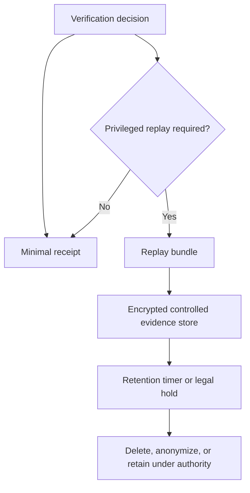

# Audit Bundle Retention and Redaction

The implementation now separates three evidence postures.

| Profile | Default content | Access requirement | Intended use |
|---|---|---|---|
| `minimal_receipt` | Digested identifiers and decision metadata | `trqp.receipt.read` | Routine operational decision |
| `replay_bundle` | Raw request and process evidence | `trqp.audit.export` | Bounded dispute replay |
| `regulated_evidence` | Full controlled evidence | `trqp.audit.regulated` | Documented legal or regulatory obligation |

The `/trqp/audit-bundle` endpoint defaults to `minimal_receipt`. Raw replay profiles require an `X-TRQP-Scopes` header containing the profile's access scope. This is a reference authorization pattern, not a production identity system.

Retention must be configured per artifact. See `schemas/retention-policy.schema.json` and `examples/privacy/retention-policy.json`.
