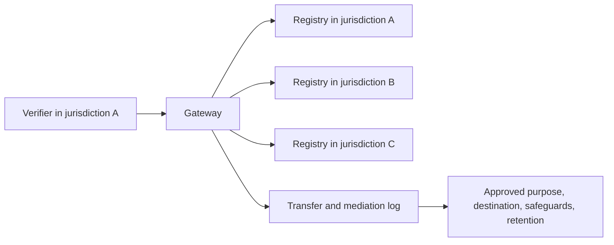

# Cross-Border and Federation

Federated routing can disclose actor, action, resource, and context information to multiple authorities. A gateway must therefore treat route selection as a data-disclosure decision.

## Required controls

- route only to authorities necessary for the query;
- document destination, purpose, data categories, and retention;
- prevent exploratory broadcast queries across all registries;
- minimize mediation traces;
- apply contractual, legal, and technical safeguards appropriate to the deployment;
- permit jurisdiction-specific profiles and registry exclusions;
- avoid assuming that federation automatically authorizes international transfer.
