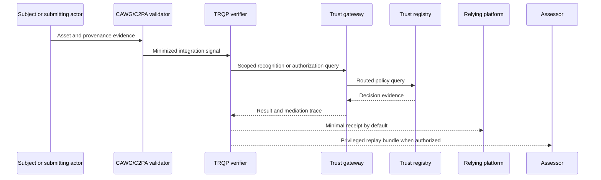

# Data Flow and Role Allocation

## Role allocation

Software topology does not by itself determine regulatory roles. The party deciding why and how verification is used will often carry the primary controller or data-fiduciary responsibility. A registry or gateway may be a processor, joint controller, or independent controller depending on whether it retains query histories, defines secondary purposes, or combines data.

| Component | Questions to resolve |
|---|---|
| Relying platform | Why is verification performed? What consequence follows? How are notice, review, and rights handled? |
| CAWG adapter | Which fields are extracted and why? Are source bindings retained? |
| Verifier | What is logged, cached, or exported? Which privacy profile applies? |
| Gateway | Which registries receive the query? Is routing metadata retained? |
| Registry | Is query activity logged or reused? How are records corrected? |
| Assessor | What evidence is copied, and for how long? |

The machine-readable starting point is `governance/privacy-responsibility-matrix.yaml`.
