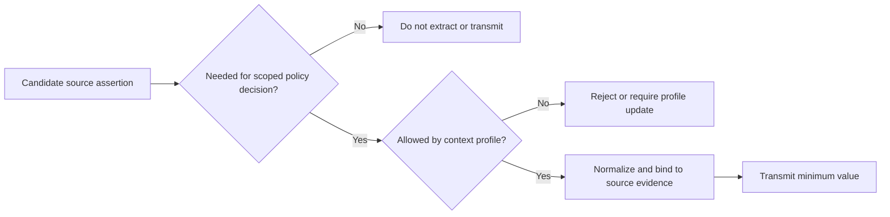

# Data Minimization and Context Profiles

The generic `context` and `process_evidence` objects are extension points, not permission to transmit arbitrary information. Production deployments should define an allow-listed context profile.

## Required CAWG adapter behavior

- map each output field to a validated source assertion;
- reject ambiguous actor or issuer mappings;
- never insert raw manifests into `context`;
- exclude names, contact details, government identifiers, biometric templates, exact location, and sensitive attributes unless a separately approved profile requires them;
- record the mapping and context-profile version;
- fail explicitly when mandatory policy inputs are absent.

`schemas/context-profile.schema.json` and `examples/privacy/context-profile.json` provide a machine-verifiable pattern.
