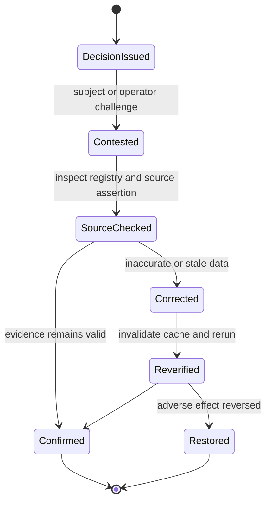

# Rights, Correction, and Redress

A trust decision can affect publication, distribution, access, reputation, or revenue. Deployments therefore need a correction and redress path even when a particular law does not use the same terminology.

## Required operational capabilities

- locate relevant registry records and evidence references;
- correct inaccurate source data at the authoritative source;
- invalidate affected cache entries;
- replay the decision against corrected evidence;
- record the correction and restoration outcome;
- provide human review for materially adverse automated outcomes;
- distinguish unknown, insufficient, expired, revoked, disputed, and invalid states.
