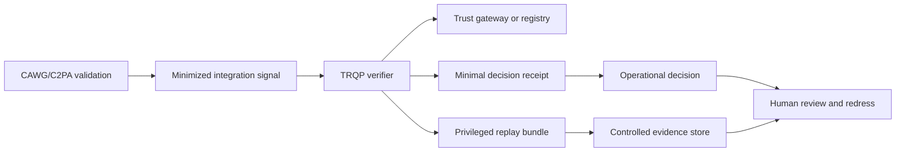

# Privacy and Personal Information

This section defines the privacy, personal-information, and data-security controls required to move the reference implementation from a functional demonstration to a governable deployment pattern. It is non-normative and does not assert compliance with any jurisdiction. A deployer must map the controls to its actual purpose, role, data, users, geography, and legal obligations.

## Reading paths

- **Privacy and legal teams:** [Privacy and Personal Information](privacy-and-personal-information.md), [Regulatory Considerations](regulatory-considerations.md), and [Data Flow and Role Allocation](data-flow-and-role-allocation.md).
- **Architects and implementers:** [Data Minimization and Context Profiles](data-minimization-and-context-profiles.md), [Audit Bundle Retention and Redaction](audit-bundle-retention-and-redaction.md), and [Privacy Threat Model](privacy-threat-model.md).
- **Operators and governance teams:** [Data-Subject Rights and Correction](data-subject-rights-and-correction.md) and [Cross-Border and Federation](cross-border-and-federation.md).

## Executable artifacts

| Artifact | Purpose |
|---|---|
| `governance/data-inventory.yaml` | Field classification and default handling |
| `governance/processing-purpose-registry.yaml` | Allowed processing purposes |
| `governance/privacy-responsibility-matrix.yaml` | Deployment-role allocation |
| `schemas/privacy-profile.schema.json` | Privacy-profile contract |
| `schemas/context-profile.schema.json` | Allow-listed context contract |
| `schemas/retention-policy.schema.json` | Retention and disposition contract |
| `schemas/redaction-policy.schema.json` | Redaction rules |
| `profiles/privacy/*.json` | Minimal, replay, and regulated evidence profiles |

## Governing principle

The implementation should disclose and retain the least information needed to answer the scoped trust question. Replayability is valuable, but it does not automatically justify retaining raw identifiers, full context, or process evidence indefinitely.
