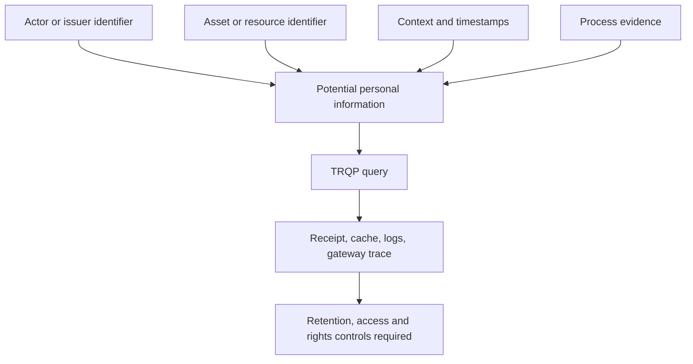

# Privacy and Personal Information

## What can become personal information

The protocol fields are not inherently personal, but `entity_id`, `issuer_id`, `asset_id`, `resource`, timestamps, `context`, and `process_evidence` can identify or describe a natural person. Their combination can also reveal activity, relationships, location, role, or attempted use.

## Privacy-by-design requirements

1. Define the verification purpose before collecting fields.
2. Classify every field and prohibit sensitive data by default.
3. Use a governed context profile rather than arbitrary JSON in production.
4. Return a minimal receipt by default.
5. Require a privileged scope for raw replay bundles.
6. Bound retention for requests, caches, logs, receipts, and evidence.
7. Support correction, revocation propagation, review, and restoration.
8. Document cross-border routing and registry-query disclosure.
9. Produce evidence that controls were applied.

## Claim boundary

The repository provides controls and evidence patterns. It does not determine lawful basis, controller status, transfer legality, retention periods, or jurisdiction-specific compliance. Those remain deployment decisions.
