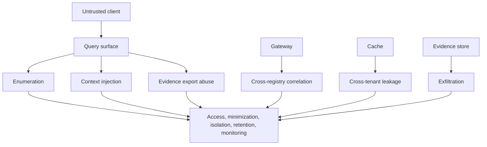

# Privacy Threat Model

| Threat | Example | Control evidence |
|---|---|---|
| Actor enumeration | Repeatedly test whether individuals are recognized | authenticated clients, rate limits, response minimization |
| Relationship inference | Discover label, employer, or delegation links | scoped authorization, minimal reason codes, gateway policy |
| Context injection | Insert sensitive attributes into arbitrary JSON | allow-listed context schema |
| Audit exfiltration | Request raw replay bundles | privileged export scope and access log |
| Cross-tenant cache leakage | Reuse decision across authorities | canonical authority-bound cache keys |
| Pseudonym reversal | Dictionary attack on plain hashes | keyed digests and key governance |
| Registry correlation | Link queries across jurisdictions | routing minimization and retention limits |
| Stale adverse decision | Corrected record not propagated | revocation and cache invalidation tests |

