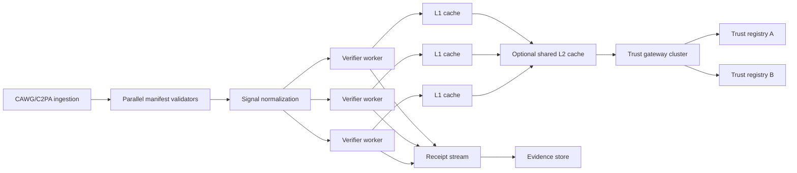

# Scalability and performance

## Status and claim boundary

This repository provides a **scale-testable reference architecture**. It does not claim that an unmodified deployment sustains 100,000 objects per second. Any throughput claim is valid only when accompanied by machine-readable evidence tied to a commit, workload, hardware, worker model, cache topology, registry latency, evidence mode, test duration, and error rate.

The files in `examples/benchmark_*` are functional workload fixtures. They are not performance results.

## Separate the rates

A high-volume deployment must measure distinct rates:

| Rate | Meaning |
|---|---|
| Object ingestion | Assets entering the CAWG/C2PA workflow |
| Cryptographic validation | Manifests and signatures validated |
| Trust-decision evaluation | Composite decisions produced |
| Live TRQP lookup | Requests reaching a registry or gateway |
| Evidence export | Receipts or audit bundles serialized and retained |

Object throughput is not the same as registry lookup throughput. A normalized authorization decision may be reused for many objects that share the same authority, actor, action, resource, context and policy epoch.

A planning approximation is:

```text
live lookup rate = object rate × cache-miss rate × policy queries per miss
```

At 100,000 objects per second, a 99.9% cache hit ratio reduces the expected miss rate to roughly 100 objects per second before accounting for recognition calls.

## Reference deployment topology



The synchronous path should remain bounded. Full audit-bundle retention can be separated from immediate decision delivery where the assurance profile permits it.

## Scale controls

Production deployments should provide:

- horizontally scaled verifier workers;
- long-lived or shared decision caches rather than request-local caches;
- deterministic cache keys that include authority and normalized context;
- request coalescing for simultaneous misses;
- backpressure and bounded queues;
- registry timeouts, circuit breakers and explicit failure behavior;
- asynchronous evidence persistence where permitted;
- cache, gateway, registry and receipt-stream telemetry.

The bundled `TTLCache` is a thread-safe L1 reference adapter. It is not a distributed cache. A shared L2 implementation may be supplied through the `DecisionCache` contract.

## Required evidence

Use `benchmarks/benchmark_verifier.py` and `benchmarks/benchmark_http.py` as reproducible starting points. Publish results conforming to `schemas/performance-evidence.schema.json`.

Minimum scenarios are warm cache, cold cache, mixed hit ratio, gateway mediation, full audit bundle, expiry storm, injected registry latency and registry failure. CI should run smoke tests; production-scale tests should run in an environment representative of the target deployment.

## Assurance questions

A scale review is incomplete unless it answers:

1. Which stage is saturated first?
2. What cache-hit ratio is assumed and observed?
3. How quickly do revocation and policy-epoch changes invalidate reuse?
4. What evidence is emitted when stale or degraded data is used?
5. What is the fail-closed, deferred or indeterminate behavior under overload?
6. Can a result be replayed against the same policy epoch and transformation version?
