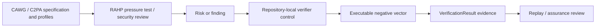

# Semantic Assurance and RAHP Traceability

## Purpose

This repository uses external assurance analysis as **reference evidence** for implementation hardening. The RAHP Toolkit CAWG/C2PA corpus and security-hardening review motivated several v0.19.0 controls, but RAHP is **not** a runtime dependency, normative authority, or substitute for CAWG, C2PA, or TRQP specifications.

The implementation pattern is:

## Reference work

The external reference work is the **RAHP Toolkit**, maintained separately under the same GitHub account. Relevant CAWG/C2PA materials in the assessed archive include:

- `docs/cawg-risk-register.md`
- `examples/security-hardening/cawg-c2pa-stack/SECURITY_REVIEW.md`
- `examples/security-hardening/cawg-c2pa-stack/findings.yaml`
- `examples/cawg-c2pa/compositions/portfolio-stack/`
- `examples/cawg-c2pa/compositions/consent-tdm/`
- `examples/cawg-c2pa/compositions/identity-metadata/`

Repository reference: `https://github.com/sankarshanmukhopadhyay/rahp-toolkit`.

If that repository is renamed or reorganized, the identifiers below remain evidence references to the assessed RAHP corpus rather than imported normative identifiers.

## Traceability

| RAHP item | Finding | Verifier response | Executable evidence |
|---|---|---|---|
| `CRK-23` / `SEC-CW-004` | Optional assertion stripping can downgrade a relying-party decision | `controls.assertions.required_labels`; explicit missing/unsupported inventory | `test_required_assertion_missing_fails_before_authority_lookup`, `test_missing_required_assertion_warns_as_degraded_not_trusted` |
| `CRK-28` / `SEC-CW-005` | A single success UX can mask unperformed checks | `VerificationResult.propositions`; explicit `not_evaluated`; warning paths produce `degraded` | semantic-assurance tests plus existing verifier/process tests |
| `CRK-04` / `SEC-CW-006` | Conflicting valid assertions can create policy confusion | `controls.conflicts.rules`; unresolved conflicts can fail; precedence must be explicitly configured | `test_conflicting_assertions_fail_under_explicit_policy`, `test_precedence_rule_records_resolution_without_inventing_global_semantics` |
| `CRK-12` | Required-evidence downgrade ambiguity | required assertion expectations distinguish absence from acceptance | assertion inventory in `assertion_evaluation` |

## Governance boundary

The repository makes four authority boundaries explicit:

1. **CAWG/C2PA own their specifications.** This implementation does not rewrite assertion optionality or semantics.
2. **RAHP supplies assurance findings, not runtime policy.** A RAHP finding can motivate a control or test but cannot become a trust decision by itself.
3. **The relying party owns profile-local expectations.** Required assertion labels and conflict precedence are deployment/profile decisions unless a governing specification explicitly defines them.
4. **TRQP supplies trust-state queries.** Semantic assurance runs before and alongside TRQP authorization/recognition; cryptographic integrity, assertion presence, authority, and policy satisfaction remain separate propositions.

## Result semantics

`VerificationResult` now exposes three additional evidence surfaces:

- `assertion_evaluation`: expected, present, missing, unsupported, and unknown assertion labels;
- `conflict_evaluation`: detected contradictions, resolution status, and any selected precedence result;
- `propositions`: separate status for asset integrity, assertion expectation, assertion conflict, issuer recognition, actor authorization, and process integrity.

An unperformed proposition is never represented as passed. A fail-level semantic guardrail stops before authority lookup. A warn-level semantic gap can allow downstream evaluation but changes an otherwise trusted result to `degraded`.

## Assurance claim

v0.19.0 supports the following repository-local claim:

> The reference verifier does not silently equate asset integrity, assertion availability, issuer recognition, actor authorization, process integrity, or conflict resolution. Required semantic checks are profile-controlled, their execution state is observable, and configured failures produce deterministic evidence.

This is a testable implementation claim, not an assertion of CAWG/C2PA conformance or independent assurance.
