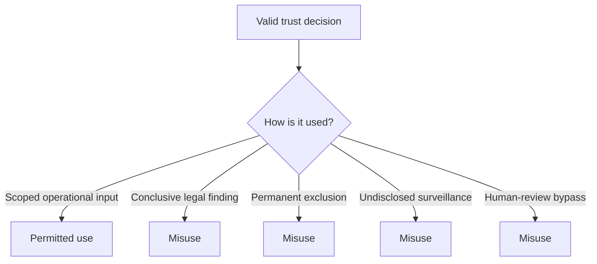

# Abuse and Misuse Cases

Security can fail even when no component is compromised. This section covers harmful uses of valid capabilities.

| Misuse | Harm | Required guardrail |
|---|---|---|
| Treating `unknown` as fraudulent | unjust exclusion | distinct reason codes and human review |
| Using registry queries to map relationships | surveillance and competition harm | purpose binding, minimization, query controls |
| Converting a provisional result into a permanent sanction | disproportionate impact | expiry, appeal, restoration |
| Using recognition governance as an industry blacklist | market exclusion | transparent criteria, independent review, redress |
| Retaining full audit bundles by default | activity profiling | minimal receipt default and bounded retention |
| Silent fail-open under outage | unauthorized action | explicit degraded state and profile rules |
| Silent fail-closed for low-risk activity | unnecessary denial | proportionality and exception authority |
| Dominant participant captures profile governance | ecosystem centralization | multi-stakeholder decision rights and evidence |

The abuse-case register is machine-readable at [`governance/abuse-case-register.yaml`](../../governance/abuse-case-register.yaml).
