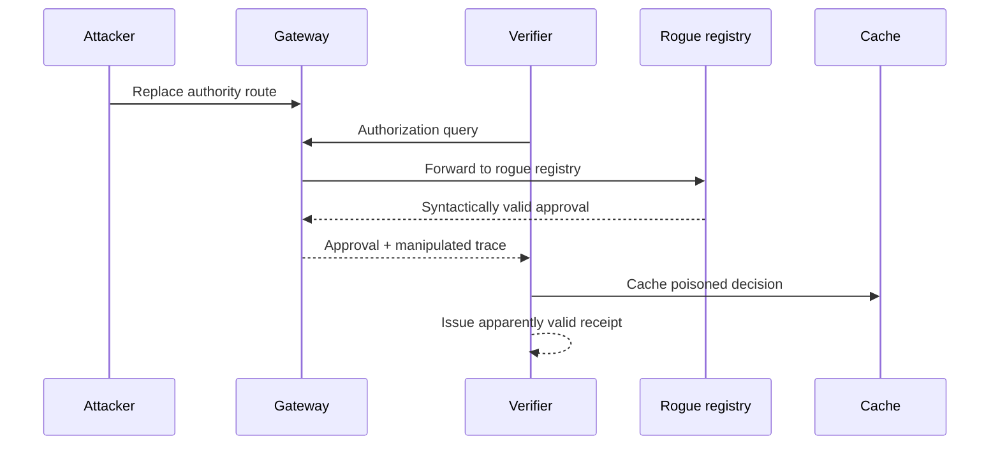
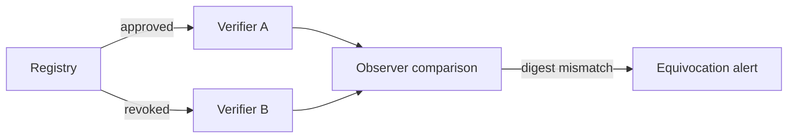
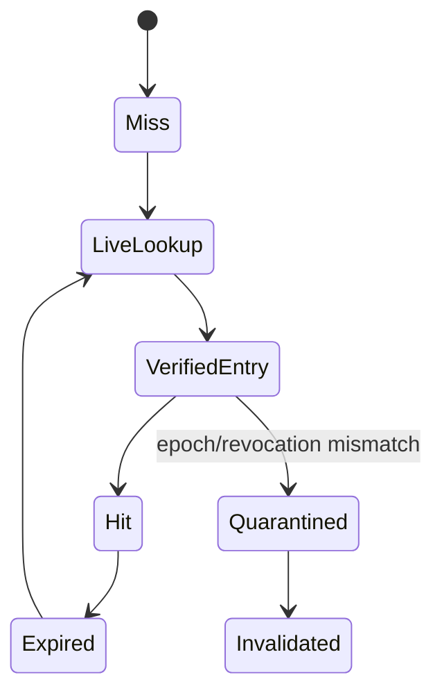

# Adversarial Scenarios

The canonical scenarios are represented as YAML examples under [`examples/threats/`](../../examples/threats/). Each scenario identifies preconditions, attack path, impact, controls, evidence, tests, and residual risk.

## Gateway route substitution

Required controls include signed route descriptors, route-authority pinning, route evidence in receipts, cache invalidation, and route-key revocation.

## Registry equivocation

## Cache poisoning and stale extension

## Parser resource exhaustion

Controls must bound input size, parsing time, nesting, decompression ratio, and unsupported-format behavior before policy evaluation begins.

## Governance policy capture

A technically valid policy update can still be abusive. Material recognition, exclusion, override, and revocation changes require documented authority, review, evidence, effective period, appeal, and reassessment.
