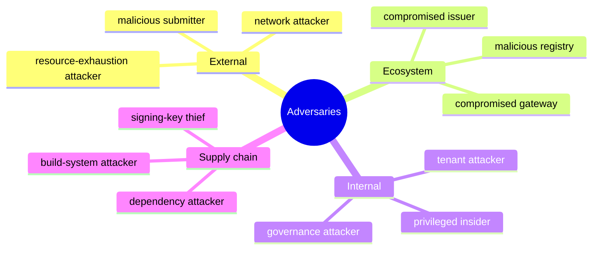

# Adversary Profiles

| ID | Adversary | Representative capability | Primary concern |
|---|---|---|---|
| ADV-01 | Malicious content submitter | Controls asset, manifest, assertions, and timing | parser abuse, ambiguous mapping, forged claims |
| ADV-02 | Fraudulent actor | Uses stolen or fabricated identifiers | false authorization |
| ADV-03 | Compromised issuer | Issues unauthorized assertions | issuer trust abuse |
| ADV-04 | Malicious registry operator | Publishes false or split-view state | policy poisoning and equivocation |
| ADV-05 | Compromised gateway | Rewrites routes or responses | authority substitution and correlation |
| ADV-06 | Network attacker | Observes, delays, redirects, or replays traffic | confidentiality, replay, availability |
| ADV-07 | Privileged insider | Accesses configuration, evidence, or keys | undetected policy and evidence manipulation |
| ADV-08 | Tenant attacker | Probes shared caches and endpoints | cross-tenant leakage |
| ADV-09 | Supply-chain attacker | Compromises dependency, package, build, or CI | systemic code and artifact compromise |
| ADV-10 | Resource-exhaustion attacker | Creates expensive validation and fan-out | denial of service |
| ADV-11 | Evidence manipulator | Alters receipts, bundles, or replay inputs | false audit outcomes |
| ADV-12 | Governance attacker | Captures recognition, revocation, or appeal | legitimate-looking exclusion or abuse |

Adversary records are maintained in [`governance/adversary-catalog.yaml`](../../governance/adversary-catalog.yaml).
