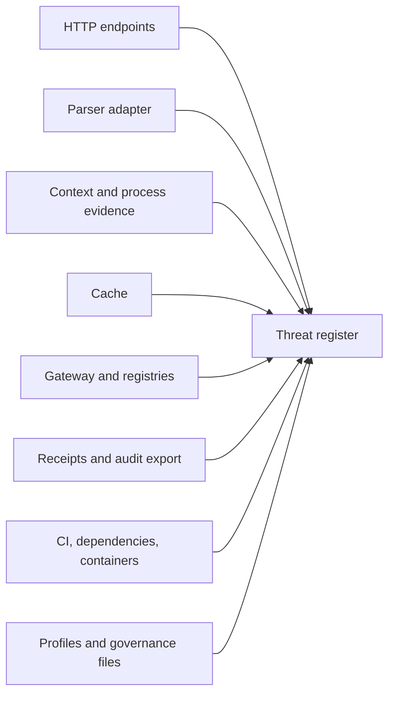

# Attack Surface Analysis

## Surface inventory

| Surface | Entry points | Typical attacks | Required posture |
|---|---|---|---|
| HTTP service | all POST endpoints | enumeration, replay, oversized requests, audit export abuse | authn, authz, rate limits, bounded bodies |
| CAWG parser boundary | binary asset and manifest | parser differential, decompression bomb, unsupported assertion downgrade | isolation, limits, deterministic extraction |
| Context/process evidence | extensible fields | injection, excessive data, cache-key manipulation | allow-listed profiles |
| Cache | key/value operations | poisoning, collision, stale extension, eviction attack | canonicalization, integrity, invalidation |
| Trust gateway | route table and mediation | route substitution, downgrade, selective denial | signed routes, authority pinning |
| Registry | recognition/authorization state | false state, equivocation, rollback, revocation suppression | signatures, epochs, observer comparison |
| Evidence export | receipt and bundle endpoints | exfiltration, truncation, replay substitution | scopes, redaction, digest validation |
| Build and release | dependencies, CI, packages | dependency confusion, workflow tampering, artifact substitution | pinning, attestations, least privilege |
| Governance configuration | profiles, trust lists, overrides | silent weakening, capture, unauthorized changes | review, signatures, approval evidence |

Every listed surface must have at least one associated threat in the machine-readable threat register.
