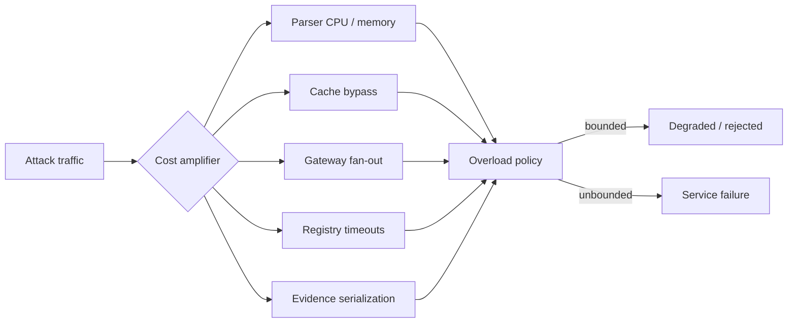

# Denial of Service and Scale Abuse

High-volume claims and cache behavior create adversarial opportunities. An attacker may intentionally force cold lookups, expensive parsing, gateway fan-out, cache eviction, or audit-bundle generation.

## Required controls

- per-client and per-authority rate limits;
- bounded request size and parsing budgets;
- cache-key cardinality controls;
- single-flight request coalescing;
- circuit breakers and registry timeout budgets;
- maximum gateway fan-out;
- separate privilege and quotas for audit export;
- queue depth, saturation, and error-rate telemetry;
- explicit fail-closed, indeterminate, or deferred behavior.

Performance evidence must report cache-hit ratio, live-query rate, latency percentiles, errors, and tested environment. See [Scalability and Performance](../scalability-and-performance.md).
