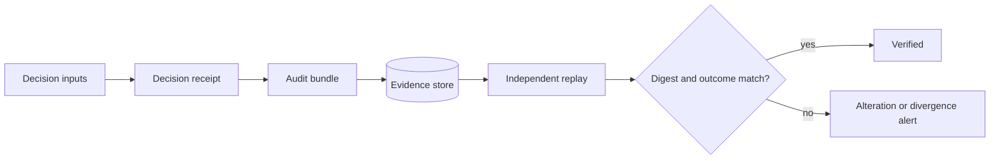

# Evidence and Replay Threats

## Threats

- receipt alteration;
- replay-input substitution;
- digest-algorithm confusion;
- evidence truncation;
- audit-bundle exfiltration;
- false replay success;
- signing-key compromise;
- retention manipulation;
- deletion of adverse evidence;
- mixing evidence from different tenants or policy epochs.

## Controls

- canonical serialization and explicit algorithm identifiers;
- digest coverage over all replay-critical fields;
- signed attestations where required;
- privacy profile and privileged export scopes;
- append-only event records with bounded retention policy;
- tenant and authority binding;
- independent replay implementation;
- failed-replay evidence and alerting;
- correction records that preserve superseded decision lineage.

Integrity without confidentiality is insufficient; confidentiality without replay fidelity is also insufficient.
