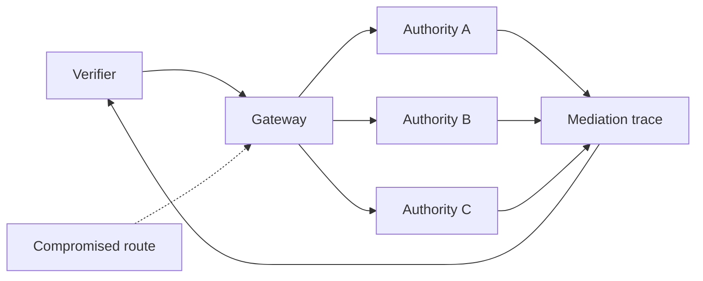

# Federation and Gateway Threats

Federation distributes authority but introduces routing, recognition, correlation, and split-view risks.

| Threat | Required control | Evidence |
|---|---|---|
| Route substitution | signed routes and authority pinning | descriptor digest and mediation trace |
| Authority downgrade | minimum assurance policy | selected route and profile |
| Selective denial | retry and observer comparison | timeout and route-attempt evidence |
| Response rewriting | authenticated registry response | response signature/digest |
| Query correlation | minimization and partitioning | privacy profile and route log policy |
| Federation loop | hop limit and visited-authority set | mediation trace |
| Split-view registry | cross-observer digest comparison | equivocation report |
| Cross-jurisdiction routing | approved transfer and routing policy | route jurisdiction metadata |

A gateway is an accountable policy mediator, not neutral plumbing.
