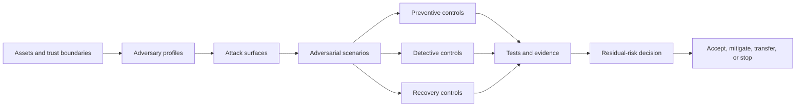

# Threats and Risks

This section provides the adversarial assurance model for the complete CAWG–TRQP trust pipeline. It complements the [Risk Crosswalk](../risk-crosswalk.md), [Privacy Threat Model](../privacy/privacy-threat-model.md), [Operational Hardening](../operational-hardening.md), and repository [Security Policy](../../SECURITY.md).

The model treats governance, federation, caching, evidence, and recovery as security-critical surfaces. It therefore covers both technical compromise and harmful but technically valid use.

## Reading paths

| Reader | Start with |
|---|---|
| Architect or security reviewer | [System Threat Model](system-threat-model.md) |
| Operator | [Operational Response and Recovery](operational-response-and-recovery.md) |
| Gateway or registry implementer | [Federation and Gateway Threats](federation-and-gateway-threats.md) |
| Evidence or assurance team | [Evidence and Replay Threats](evidence-and-replay-threats.md) |
| Release engineer | [Supply Chain and Build Security](supply-chain-and-build-security.md) |
| Governance authority | [Abuse and Misuse Cases](abuse-and-misuse-cases.md) and [Residual Risk Register](residual-risk-register.md) |

## Machine-verifiable artifacts

- [`governance/adversary-catalog.yaml`](../../governance/adversary-catalog.yaml)
- [`governance/attack-surface.yaml`](../../governance/attack-surface.yaml)
- [`governance/threat-register.yaml`](../../governance/threat-register.yaml)
- [`governance/abuse-case-register.yaml`](../../governance/abuse-case-register.yaml)
- [`governance/residual-risk-register.yaml`](../../governance/residual-risk-register.yaml)

The repository does not claim that risk is eliminated. It makes ownership, controls, evidence, acceptance, expiry, and reassessment explicit.
