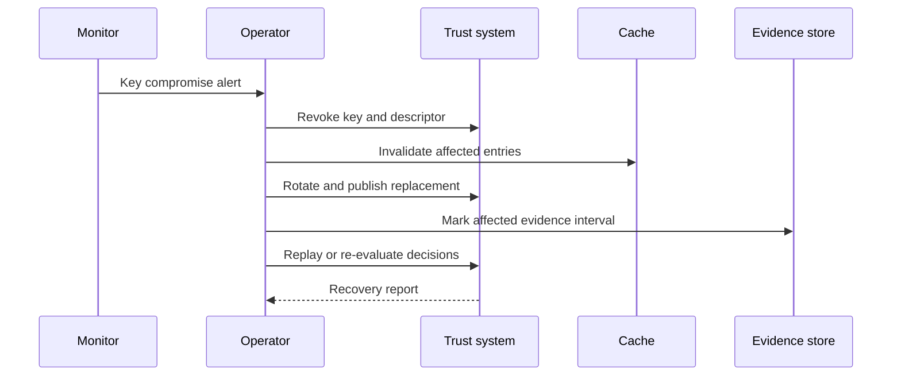

# Key Compromise and Recovery

Keys may protect CAWG assertions, registry responses, feed descriptors, gateway routes, decision receipts, or release artifacts. Compromise must be recoverable without silently preserving attacker-issued trust.

## Recovery requirements

1. Identify key scope and affected time interval.
2. Revoke or distrust the compromised key.
3. Invalidate routes, descriptors, cache entries, and snapshots derived from it.
4. Rotate keys under independent approval.
5. Re-evaluate affected decisions where material.
6. Preserve incident and restoration evidence.
7. Notify relying parties according to deployment policy.
8. Reassess residual risk before resuming normal operation.
