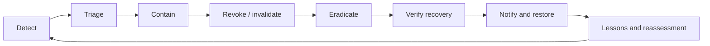

# Operational Response and Recovery

## Response evidence

| Stage | Required evidence |
|---|---|
| Detect | alert, timestamp, source, affected component |
| Triage | threat ID, scope, severity, decision authority |
| Contain | blocked clients, disabled routes, quarantined evidence |
| Revoke | keys, credentials, cache entries, descriptors, policies |
| Recover | rebuilt artifacts, replay results, control verification |
| Restore | approval, residual-risk decision, communications |
| Learn | root cause, control changes, test additions, expiry |

## Decision authority

Emergency overrides must identify who authorized them, their scope, effective time, expiry, evidence, and revocation path. An override that cannot be revoked is not an acceptable governance control.
