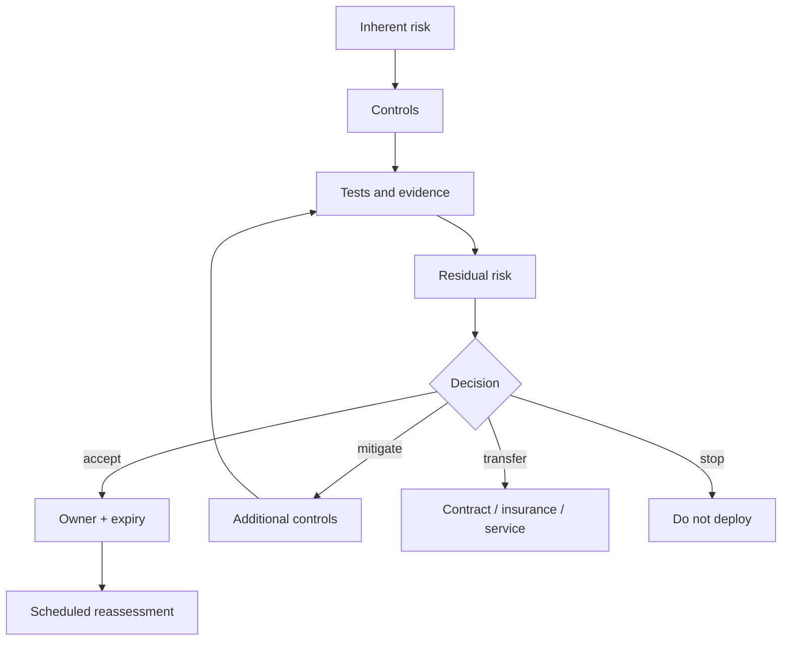

# Residual Risk Register

Residual risk is a governed decision, not an undocumented remainder.

Every accepted risk must state:

- accountable owner;
- decision authority;
- rationale;
- affected scope;
- current controls;
- monitoring indicators;
- acceptance expiry;
- reassessment triggers;
- revocation or stop condition;
- evidence references.

The authoritative machine-readable register is [`governance/residual-risk-register.yaml`](../../governance/residual-risk-register.yaml). Acceptance entries without an owner or expiry fail repository conformance.
