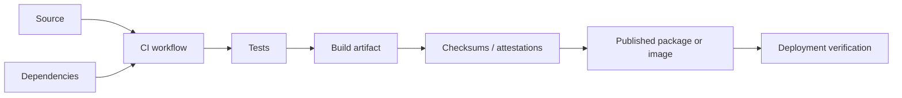
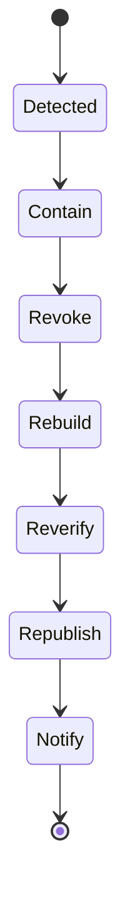

# Supply Chain and Build Security

## Required controls

- pin and review dependencies;
- minimize CI permissions;
- protect branches and release workflows;
- generate reproducible checksums and provenance;
- scan packages and container images;
- separate build and signing authority;
- rotate and revoke compromised credentials;
- verify artifacts before deployment;
- preserve test, commit, and environment evidence.

## Compromise response

A release artifact must never be trusted only because it was obtained from the expected repository location.
