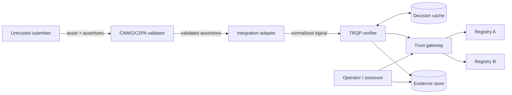
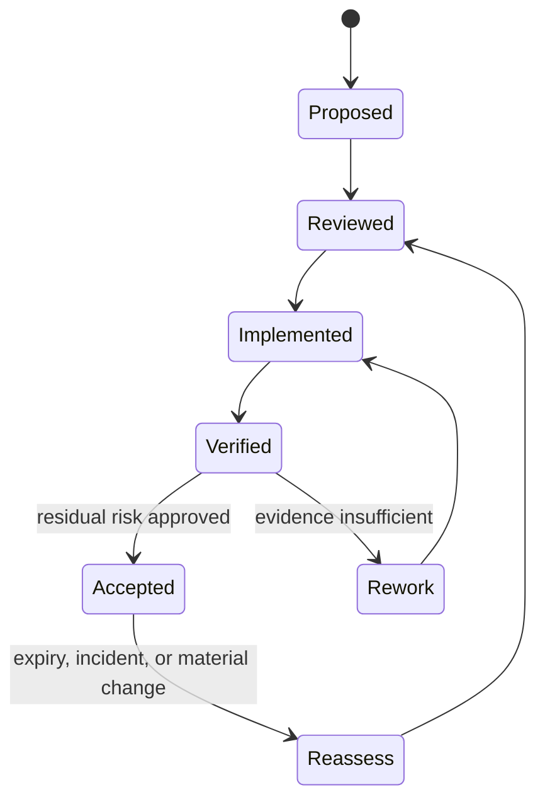

# System Threat Model

## Scope

The model covers untrusted content intake, CAWG/C2PA validation, signal normalization, TRQP verification, decision caching, trust-gateway routing, registry responses, receipt generation, audit export, replay, and operator administration.

## Security objectives

| Objective | Required property |
|---|---|
| Authority integrity | Only recognized authorities can supply applicable decisions |
| Scope integrity | Actor, action, resource, context, and time remain correctly bound |
| Freshness | Policy and revocation evidence satisfy the active profile |
| Confidentiality | Queries and evidence disclose only necessary information |
| Availability | Degradation is bounded, observable, and governed |
| Replay fidelity | Independent replay can detect altered inputs or evidence |
| Revocability | Compromised authority, keys, routes, and cache entries can be withdrawn |
| Auditability | Material actions produce durable, attributable evidence |

## Trust assumptions

1. A validator that reports successful CAWG/C2PA validation has correctly enforced its parser and cryptographic profile.
2. Registry and gateway identities are authenticated outside the mock transport used by the reference implementation.
3. Operators protect signing keys and deployment configuration.
4. Production deployments add authentication, transport protection, rate limiting, and tenant isolation.
5. Governance authorities explicitly approve recognition, override, and residual-risk decisions.

## Threat-model lifecycle

## Exclusions

The model does not claim to resolve copyright ownership, determine factual truth of content, replace legal process, or secure infrastructure not described by a deployment profile.
