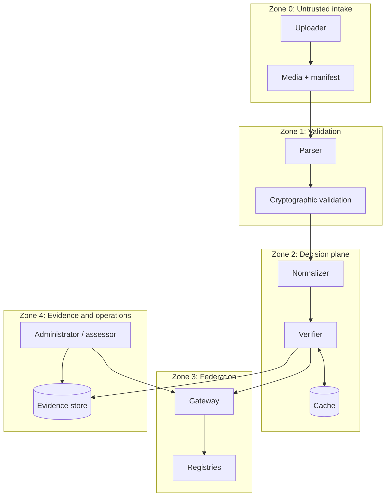

# Trust Boundaries and Assets

| Boundary | Data crossing | Required controls | Evidence |
|---|---|---|---|
| Intake → validator | Untrusted binary and assertions | size limits, parser isolation, supported-format policy | validation report |
| Validator → adapter | Validated assertion set | typed extraction, source binding, mapping version | integration signal |
| Adapter → verifier | Actor, issuer, action, resource, context | schema validation, minimization, integrity | request digest |
| Verifier → cache | Decision and policy evidence | canonical keys, tenant isolation, TTL, invalidation | cache provenance |
| Verifier → gateway | Recognition and authorization query | authentication, confidentiality, replay protection | mediation trace |
| Gateway → registry | Routed query | authority pinning, route integrity, timeout budget | route descriptor |
| Verifier → evidence store | Receipt or replay bundle | access control, encryption, retention | bundle digest and profile |
| Operator → control plane | Configuration and override | least privilege, approval, audit, revocation | change record |

Critical assets and their objectives are represented in [`governance/attack-surface.yaml`](../../governance/attack-surface.yaml).
