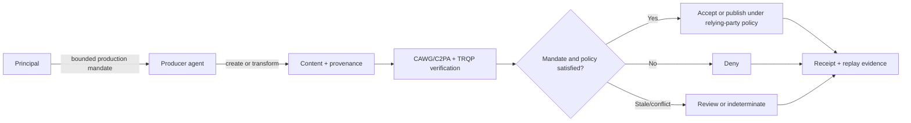
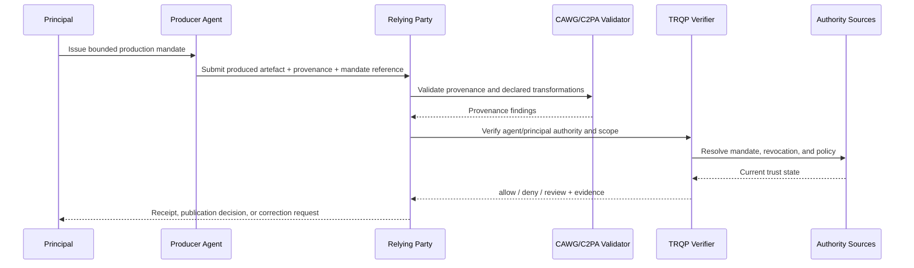
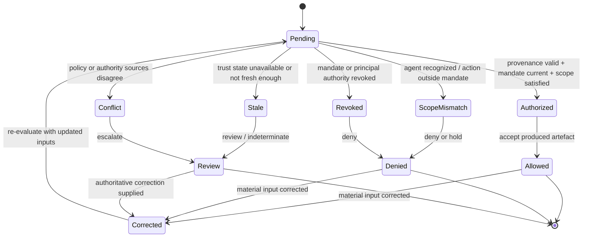
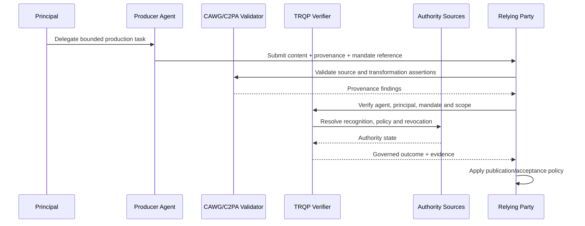

# Agent as Content Producer

This archetype covers an AI agent that creates, transforms, stages, enhances, summarizes, or otherwise produces content under delegated authority. The assurance question is not simply whether AI participated. It is whether the producer agent was authorized to perform the specific transformation on the specific source asset for the declared purpose and whether the resulting provenance can be independently evaluated.

## Decision boundary

The verifier answers: **may this agent-produced artefact be accepted as produced under a valid, in-scope mandate and declared transformation policy at the evaluated decision time?** It does not establish that the depicted or asserted subject matter is factually true.

## Plain-language summary

A principal delegates a bounded content-production task to an AI agent. The agent may create, transform, summarize, stage, or enhance material, but the relying party needs evidence that the specific transformation was authorized for the specific source, purpose, output channel, and time.

A positive result means **the artefact may be treated as produced under the evaluated mandate and transformation policy**. It does not establish that the resulting content is true, appropriate, lawful, or ready for publication. The archetype exists to keep agent identity, delegated authority, tool use, and downstream acceptance as separate governance questions.

## At-a-glance governance flow

## Cross-functional interaction view

This swimlane-style interaction view makes the delegated production path explicit by showing how principal authority, agent action, provenance validation, and relying-party acceptance fit together.

## Governed decision state model

This state model keeps delegated production governance legible by separating successful authorization from scope failure, revocation, stale trust state, conflict, and superseding correction.

## Why this agentic archetype needs verifiable governance

Agentic systems can execute many actions under one technical identity, which makes ordinary authentication a poor proxy for authority. A producer agent may be permitted to crop or summarize but not synthesize; it may be allowed to transform one source asset but not another; or it may call a sub-agent that the principal never authorized.

The walkthrough makes those limits first-class. Mandate, transformation scope, tool/sub-agent chain, revocation, and evidence lineage can all be evaluated and replayed before a relying party decides what to do with the output.

## Roles in the workflow
| Actor | Authority or responsibility |
|---|---|
| Principal | Authorizes creation/transformation and may revoke or narrow the mandate |
| Producer agent | Performs only the transformations allowed by the mandate |
| CAWG/C2PA validator | Validates asset provenance, source bindings, and declared transformations |
| TRQP verifier | Resolves agent/principal recognition, delegation, scope, policy, and revocation |
| Relying party | Decides whether to accept, label, publish, or reject the artefact |

## Agent governance concepts mapped to verifier controls

| Agent governance concept | Verifier concept | Practical meaning |
|---|---|---|
| Principal mandate | Delegation evidence | Defines who authorized the agent and for what production task |
| Source/output binding | Resource scope | Constrains which assets may be transformed and where outputs may go |
| Transformation classes | Action/policy scope | Separates permitted edits from prohibited production behavior |
| Tool/sub-agent permissions | Delegation depth/tool scope | Prevents hidden authority expansion through orchestration |
| Mandate revocation | Current authority state | Stops future production authorization after withdrawal |
## Agent-specific controls

- Bind the agent identity to the principal and mandate.
- Express permitted transformation classes, source assets, output channels, purpose, and validity period.
- Reject undeclared or out-of-scope transformations even when the agent itself is recognized.
- Preserve source-to-output provenance and the policy epoch used for evaluation.
- Require a separate mandate if the producer agent can also publish or approve its own output.

## End-to-end flow

## Assurance tests

A conforming implementation should test authorized production, missing mandate, prohibited transformation, resource mismatch, expired/revoked mandate, stale/conflicting authority state, and correction of a material provenance or authority input.

## What evidence is produced

| Evidence artifact | Primary user | What it establishes |
|---|---|---|
| Normalized verification request | Implementer / reviewer | Which actor, resource, action, context, and evidence entered the decision |
| Decision receipt | Relying party / affected party | Outcome, reason codes, policy epoch, and the bounded basis for the decision |
| Authority and revocation references | Assurance reviewer | Which governed trust sources were relied upon and their evaluated state |
| Replay inputs or audit bundle | Auditor / maintainer | Whether the original decision can be reconstructed from pinned evidence |
| Superseding receipt or correction lineage | Reviewer / affected party | How a material correction changed a later decision without rewriting history |

## What can be tested

| Test question | Artifact or command |
|---|---|
| Do the walkthrough diagrams and required reader-facing sections pass quality validation? | `python scripts/validate_walkthrough_quality.py` |
| Do Mermaid flow, interaction, and state diagrams pass structural validation? | `python scripts/validate_walkthrough_diagrams.py` |
| Do machine-readable walkthrough manifests contain the common lifecycle cases? | `python scripts/validate_walkthrough_examples.py` |
| Do agentic mandate, scope, revocation, and role-boundary requirements remain aligned? | `python scripts/validate_agentic_assurance.py` |
| Do shipped example artefacts remain structurally valid? | `python scripts/validate_examples.py` |
| Does the complete repository validation surface pass? | `make validate` |

## Why this improves adoption

This walkthrough is easier to adopt when the governance value is expressed in familiar operational terms:

- principals can delegate narrowly instead of treating an agent as globally trusted;
- content systems can inspect why a transformation was authorized;
- tool and sub-agent use becomes part of the assurance evidence;
- corrections and mandate changes create superseding, replayable decisions.

## Governance interpretation

The agent is an executor of delegated authority, not the source of that authority. The principal defines the mandate; governed sources establish current delegation and policy state; the verifier evaluates the requested production action; and the relying party remains responsible for acceptance or publication.

This keeps agent autonomy compatible with revocation, scope, and accountability rather than allowing capability to be mistaken for permission.

## Operational assurance contract

| Control point | Required behavior | Evidence |
|---|---|---|
| Decision | Evaluate agent production authorization only | Stable outcome and reason code |
| Authority | Resolve principal, producer agent, mandate, transformation scope and current state | Authority/delegation references |
| Freshness | Apply revocation and trust-state freshness rules | Timestamped authority evidence |
| Policy | Pin transformation/publication policy epoch | Policy identifier/version/digest |
| Failure | Preserve `deny`, `review`, and `indeterminate` semantics | Decision receipt |
| Correction | Supersede rather than overwrite earlier decisions | Receipt lineage |
| Handoff | Leave factual truth and publication accountability with the relying party | Relying-party disposition |

### Conformance assertions

1. agent recognition alone never authorizes content production;
2. a producer mandate does not automatically confer submission, publication, or decision authority;
3. out-of-scope transformations cannot produce `allow`;
4. revoked mandates prevent future authorized production; and
5. replay from pinned evidence reproduces the governed outcome.
