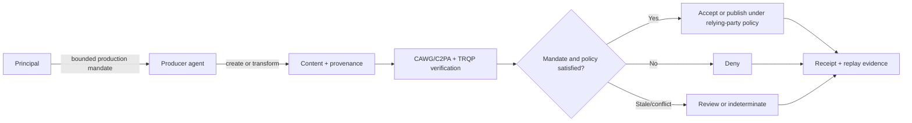
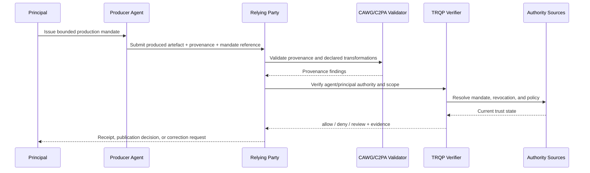
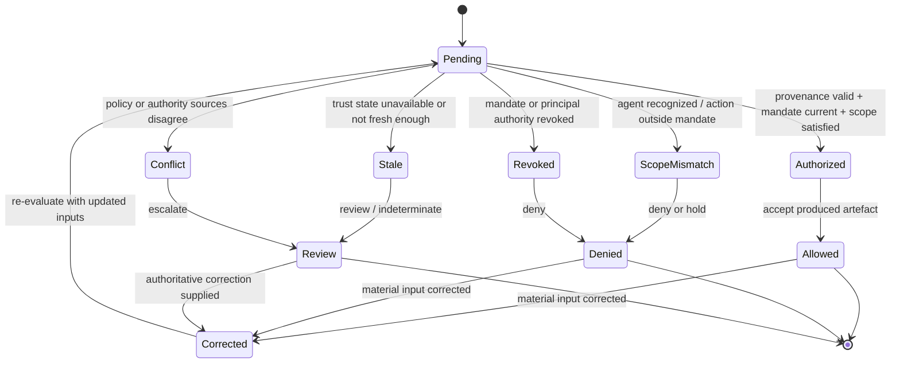
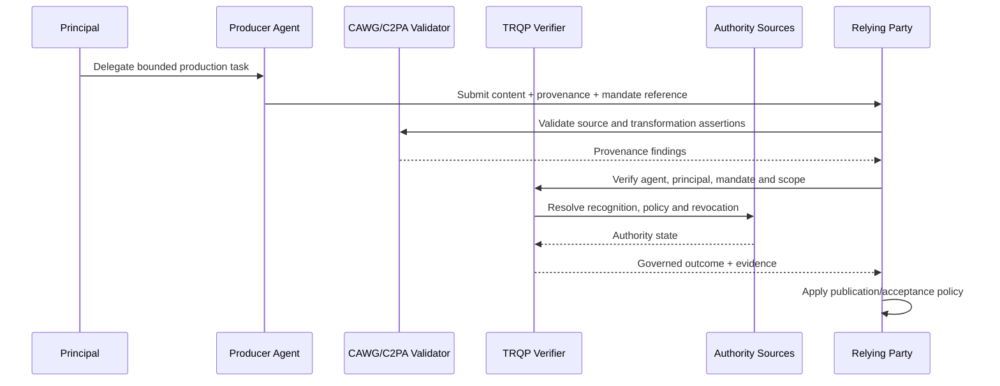

# Agent as Content Producer

This archetype covers an AI agent that creates, transforms, stages, enhances, summarizes, or otherwise produces content under delegated authority. The assurance question is not simply whether AI participated. It is whether the producer agent was authorized to perform the specific transformation on the specific source asset for the declared purpose and whether the resulting provenance can be independently evaluated.

## Decision boundary

The verifier answers: **may this agent-produced artefact be accepted as produced under a valid, in-scope mandate and declared transformation policy at the evaluated decision time?** It does not establish that the depicted or asserted subject matter is factually true.

## At-a-glance governance flow

## Cross-functional interaction view

This swimlane-style interaction view makes the delegated production path explicit by showing how principal authority, agent action, provenance validation, and relying-party acceptance fit together.

## Governed decision state model

This state model keeps delegated production governance legible by separating successful authorization from scope failure, revocation, stale trust state, conflict, and superseding correction.

## Actors and authority

| Actor | Authority or responsibility |
|---|---|
| Principal | Authorizes creation/transformation and may revoke or narrow the mandate |
| Producer agent | Performs only the transformations allowed by the mandate |
| CAWG/C2PA validator | Validates asset provenance, source bindings, and declared transformations |
| TRQP verifier | Resolves agent/principal recognition, delegation, scope, policy, and revocation |
| Relying party | Decides whether to accept, label, publish, or reject the artefact |

## Agent-specific controls

- Bind the agent identity to the principal and mandate.
- Express permitted transformation classes, source assets, output channels, purpose, and validity period.
- Reject undeclared or out-of-scope transformations even when the agent itself is recognized.
- Preserve source-to-output provenance and the policy epoch used for evaluation.
- Require a separate mandate if the producer agent can also publish or approve its own output.

## End-to-end flow

## Assurance tests

A conforming implementation should test authorized production, missing mandate, prohibited transformation, resource mismatch, expired/revoked mandate, stale/conflicting authority state, and correction of a material provenance or authority input.

## Operational assurance contract

| Control point | Required behavior | Evidence |
|---|---|---|
| Decision | Evaluate agent production authorization only | Stable outcome and reason code |
| Authority | Resolve principal, producer agent, mandate, transformation scope and current state | Authority/delegation references |
| Freshness | Apply revocation and trust-state freshness rules | Timestamped authority evidence |
| Policy | Pin transformation/publication policy epoch | Policy identifier/version/digest |
| Failure | Preserve `deny`, `review`, and `indeterminate` semantics | Decision receipt |
| Correction | Supersede rather than overwrite earlier decisions | Receipt lineage |
| Handoff | Leave factual truth and publication accountability with the relying party | Relying-party disposition |

### Conformance assertions

1. agent recognition alone never authorizes content production;
2. a producer mandate does not automatically confer submission, publication, or decision authority;
3. out-of-scope transformations cannot produce `allow`;
4. revoked mandates prevent future authorized production; and
5. replay from pinned evidence reproduces the governed outcome.
