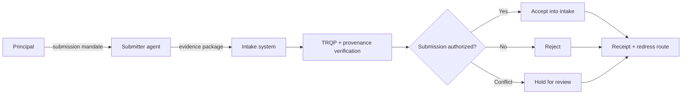
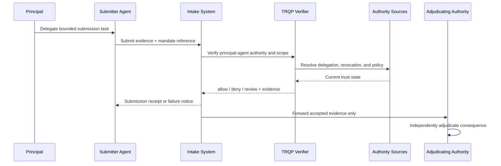
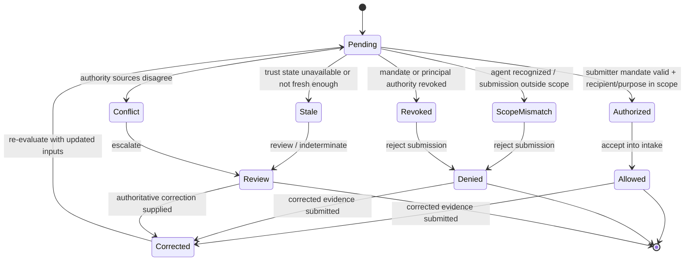
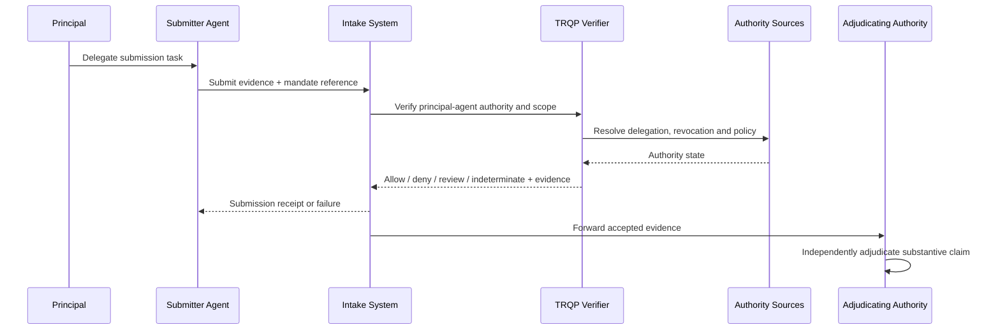

# Agent as Delegated Submitter

This archetype covers an agent that packages, transmits, files, or submits evidence on behalf of a principal. A document or image can be perfectly authentic and still be an invalid submission if the submitting agent lacked authority for that case, recipient, purpose, or time window.

## Decision boundary

The verifier answers: **may this agent submit this identified evidence to this recipient for this purpose on behalf of this principal at the evaluated decision time?** It does not decide admissibility, entitlement, liability, eligibility, or the truth of the submitted evidence.

## Plain-language summary

A principal delegates an AI agent to package and submit evidence to a specific recipient. The intake system needs to know not only that the agent is authenticated, but that it may submit this evidence, for this case or resource, to this recipient, for this purpose, at this time.

A positive result means **the submission may enter the configured intake process under the evaluated mandate**. It does not establish the truth, admissibility, eligibility, or substantive consequence of the evidence. The archetype separates delegated delivery authority from downstream adjudication.

## At-a-glance governance flow

## Cross-functional interaction view

This swimlane-style interaction view makes the submission mandate explicit by showing how principal authority, agent delivery, intake controls, and governed verification fit together.

## Governed decision state model

This state model separates a valid submission authorization from missing mandate, scope failure, revocation, stale trust state, conflict, and superseding correction.

## Why this agentic archetype needs verifiable governance

Submission agents create a subtle authority-expansion risk. An agent that is permitted to transmit a document may not be permitted to select new evidence, alter it, change the recipient, withdraw a prior filing, or submit on behalf of a different principal. Authentication alone cannot represent those distinctions.

This walkthrough makes recipient, resource, evidence class, purpose, validity period, correction rights, and sub-delegation explicit. The intake service can therefore reject an out-of-scope action without concluding anything about the underlying evidence.

## Roles in the workflow
| Actor | Authority or responsibility |
|---|---|
| Principal | Grants the right to submit defined evidence and may revoke that right |
| Submitter agent | Packages/transmits evidence without exceeding submission scope |
| Intake system | Defines recipient, channel, case/resource, timing and format requirements |
| CAWG/C2PA validator | Validates provenance of media evidence where applicable |
| TRQP verifier | Resolves principal, agent, delegation, scope, revocation and policy state |
| Adjudicating authority | Separately determines substantive consequence of the evidence |

## Agent governance concepts mapped to verifier controls

| Agent governance concept | Verifier concept | Practical meaning |
|---|---|---|
| Principal-agent mandate | Delegation evidence | Shows why the agent may submit on the principal’s behalf |
| Recipient/case binding | Resource scope | Prevents a valid mandate being replayed into another workflow |
| Permitted submission operations | Action scope | Separates transmit, modify, withdraw, and correct authority |
| Sub-delegation rights | Delegation depth | Controls whether another agent/tool may act in the chain |
| Revocation/expiry | Current authority state | Stops new submissions after the mandate ends |
## Agent-specific controls

The mandate should bind the agent to the principal, recipient, case/resource, evidence class, purpose, permitted operations, validity interval, and whether correction or withdrawal is allowed. If the agent is permitted to discover or select evidence autonomously, that authority should be explicit rather than inferred from submission authority.

## End-to-end flow

## Assurance tests

Test at least valid mandate, authenticated agent without mandate, wrong recipient, wrong case/resource, unauthorized evidence modification, expired/revoked mandate, prohibited sub-delegation, stale/conflicting authority state, and superseding correction.

## What evidence is produced

| Evidence artifact | Primary user | What it establishes |
|---|---|---|
| Normalized verification request | Implementer / reviewer | Which actor, resource, action, context, and evidence entered the decision |
| Decision receipt | Relying party / affected party | Outcome, reason codes, policy epoch, and the bounded basis for the decision |
| Authority and revocation references | Assurance reviewer | Which governed trust sources were relied upon and their evaluated state |
| Replay inputs or audit bundle | Auditor / maintainer | Whether the original decision can be reconstructed from pinned evidence |
| Superseding receipt or correction lineage | Reviewer / affected party | How a material correction changed a later decision without rewriting history |

## What can be tested

| Test question | Artifact or command |
|---|---|
| Do the walkthrough diagrams and required reader-facing sections pass quality validation? | `python scripts/validate_walkthrough_quality.py` |
| Do Mermaid flow, interaction, and state diagrams pass structural validation? | `python scripts/validate_walkthrough_diagrams.py` |
| Do machine-readable walkthrough manifests contain the common lifecycle cases? | `python scripts/validate_walkthrough_examples.py` |
| Do agentic mandate, scope, revocation, and role-boundary requirements remain aligned? | `python scripts/validate_agentic_assurance.py` |
| Do shipped example artefacts remain structurally valid? | `python scripts/validate_examples.py` |
| Does the complete repository validation surface pass? | `make validate` |

## Why this improves adoption

This walkthrough is easier to adopt when the governance value is expressed in familiar operational terms:

- intake systems can accept agent-mediated submissions without granting agents broad account authority;
- principals can delegate submission separately from evidence creation or decision rights;
- failure reasons remain specific to mandate and scope;
- adjudicators receive accepted evidence without inheriting the verifier’s authorization conclusion as a merits decision.

## Governance interpretation

Submission authority is intentionally narrower than adjudication authority. The principal may empower an agent to deliver evidence; the intake service can verify that delegation; and the competent authority separately decides what the evidence means.

This separation is critical for agentic infrastructure because it prevents a machine actor’s ability to submit from silently becoming authority to decide.

## Operational assurance contract

| Control point | Required behavior | Evidence |
|---|---|---|
| Decision | Evaluate submission authority only | Stable outcome and reason code |
| Authority | Resolve principal-agent mandate and recipient/resource/purpose scope | Delegation references |
| Freshness | Evaluate authority at submission time | Timestamped trust-state evidence |
| Policy | Pin intake/submission policy | Policy identifier/version/digest |
| Failure | Do not turn missing evidence into permission | `review`/`indeterminate` receipt |
| Correction | Preserve original submission and superseding correction | Immutable lineage |
| Handoff | Keep admissibility/eligibility/adjudication outside verifier scope | Intake and adjudication references |

### Conformance assertions

1. authentic evidence from an unauthorized submitter is not treated as an authorized submission;
2. submission authority does not imply authority to alter evidence or decide its consequence;
3. recipient, resource, purpose and time scope are independently enforced;
4. revoked/expired delegation cannot authorize a new submission; and
5. accepted submissions retain evidence sufficient to replay the authorization decision.
