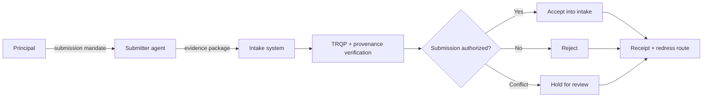
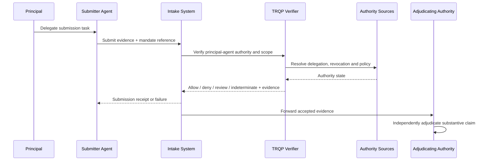

# Agent as Delegated Submitter

This archetype covers an agent that packages, transmits, files, or submits evidence on behalf of a principal. A document or image can be perfectly authentic and still be an invalid submission if the submitting agent lacked authority for that case, recipient, purpose, or time window.

## Decision boundary

The verifier answers: **may this agent submit this identified evidence to this recipient for this purpose on behalf of this principal at the evaluated decision time?** It does not decide admissibility, entitlement, liability, eligibility, or the truth of the submitted evidence.

## At-a-glance governance flow

## Actors and authority

| Actor | Authority or responsibility |
|---|---|
| Principal | Grants the right to submit defined evidence and may revoke that right |
| Submitter agent | Packages/transmits evidence without exceeding submission scope |
| Intake system | Defines recipient, channel, case/resource, timing and format requirements |
| CAWG/C2PA validator | Validates provenance of media evidence where applicable |
| TRQP verifier | Resolves principal, agent, delegation, scope, revocation and policy state |
| Adjudicating authority | Separately determines substantive consequence of the evidence |

## Agent-specific controls

The mandate should bind the agent to the principal, recipient, case/resource, evidence class, purpose, permitted operations, validity interval, and whether correction or withdrawal is allowed. If the agent is permitted to discover or select evidence autonomously, that authority should be explicit rather than inferred from submission authority.

## End-to-end flow

## Assurance tests

Test at least valid mandate, authenticated agent without mandate, wrong recipient, wrong case/resource, unauthorized evidence modification, expired/revoked mandate, prohibited sub-delegation, stale/conflicting authority state, and superseding correction.

## Operational assurance contract

| Control point | Required behavior | Evidence |
|---|---|---|
| Decision | Evaluate submission authority only | Stable outcome and reason code |
| Authority | Resolve principal-agent mandate and recipient/resource/purpose scope | Delegation references |
| Freshness | Evaluate authority at submission time | Timestamped trust-state evidence |
| Policy | Pin intake/submission policy | Policy identifier/version/digest |
| Failure | Do not turn missing evidence into permission | `review`/`indeterminate` receipt |
| Correction | Preserve original submission and superseding correction | Immutable lineage |
| Handoff | Keep admissibility/eligibility/adjudication outside verifier scope | Intake and adjudication references |

### Conformance assertions

1. authentic evidence from an unauthorized submitter is not treated as an authorized submission;
2. submission authority does not imply authority to alter evidence or decide its consequence;
3. recipient, resource, purpose and time scope are independently enforced;
4. revoked/expired delegation cannot authorize a new submission; and
5. accepted submissions retain evidence sufficient to replay the authorization decision.
