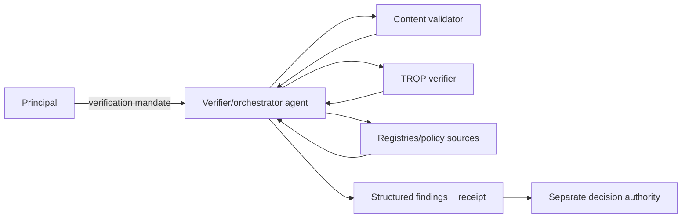
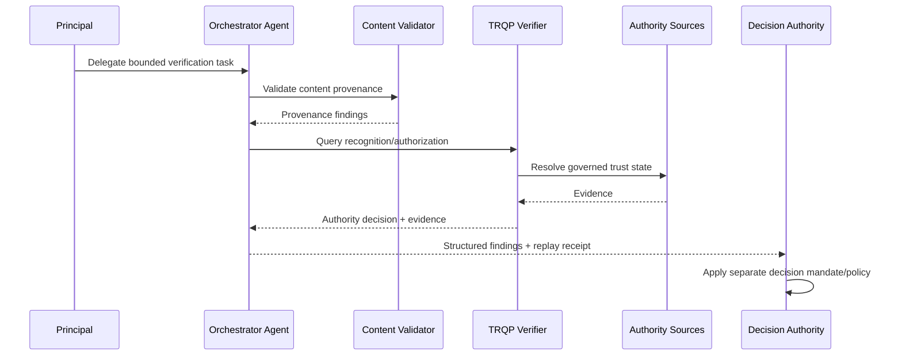

# Agent as Verifier and Orchestrator

This archetype covers an agent that invokes content validators, TRQP endpoints, registries, policy sources, and possibly other agents to assemble verification findings. The governance objective is to make the chain of delegated tool use reconstructable while preventing a verification role from silently becoming adjudication authority.

## Decision boundary

The verifier/orchestrator may produce machine-readable findings and a governed verification disposition. It may recommend or execute a downstream institutional action only if a **separate decision mandate** grants that authority.

## At-a-glance governance flow

## Actors and authority

| Actor | Authority or responsibility |
|---|---|
| Principal | Delegates verification/orchestration task and defines allowed tools/data/actions |
| Verifier/orchestrator agent | Calls approved dependencies and assembles bounded findings |
| Tool/registry providers | Return provenance, recognition, authorization, revocation or policy evidence |
| TRQP verifier | Produces authority decisions from governed trust sources |
| Decision authority | Separately decides publication, payment, enforcement, admission, or other consequence |

## Tool-chain evidence

A replayable orchestration record should identify:

- agent and principal;
- mandate and permitted tool/action scope;
- tool or downstream-agent identities;
- request and response digests or stable evidence references;
- policy/trust-state epochs;
- order of material calls where order affects outcome;
- failure and retry behavior; and
- final findings and reason codes.

## End-to-end flow

## Assurance tests

Test unauthorized tool invocation, prohibited downstream-agent delegation, stale dependency evidence, conflicting authority sources, tool failure, replay from pinned outputs, and an attempted transition from verifier role to a downstream action without a separate decision mandate.

## Operational assurance contract

| Control point | Required behavior | Evidence |
|---|---|---|
| Decision | Evaluate verification/orchestration authority and produce bounded findings | Stable findings and reason codes |
| Authority | Resolve agent mandate plus tool/delegation scope | Mandate and tool authorization references |
| Freshness | Pin material trust and policy inputs | Timestamped evidence/digests |
| Policy | Preserve verifier policy separately from downstream decision policy | Policy identifiers/digests |
| Failure | Surface unavailable/conflicting dependencies explicitly | `review`/`indeterminate` findings |
| Correction | Supersede earlier receipts when material inputs change | Receipt lineage |
| Handoff | Require distinct authority for substantive downstream action | Decision-authority reference |

### Conformance assertions

1. verifier authority does not imply downstream decision authority;
2. unapproved tools or agents cannot be invoked under the verification mandate;
3. material calls are evidenced sufficiently for deterministic replay;
4. dependency uncertainty is not coerced into `allow`; and
5. an independent reviewer can distinguish source evidence, verifier findings, policy evaluation, and final institutional action.
