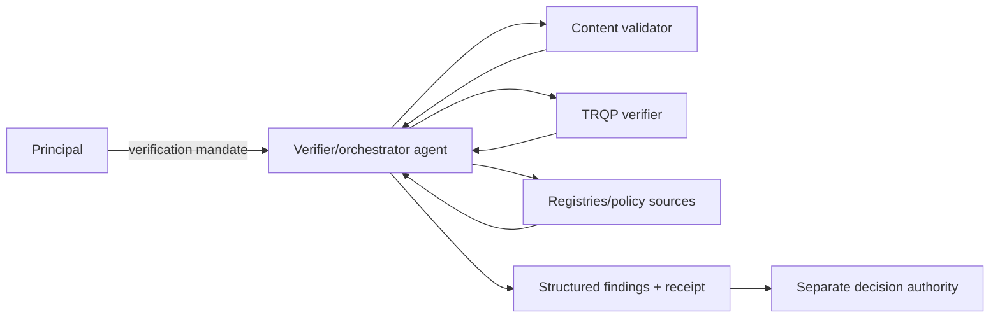
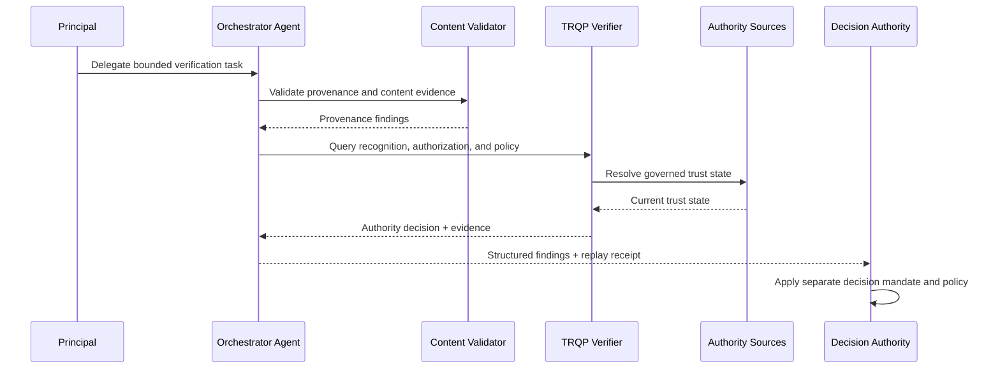
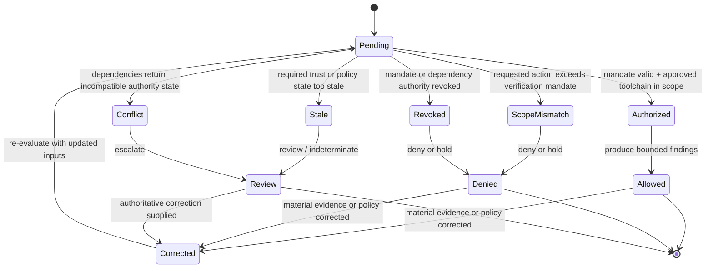
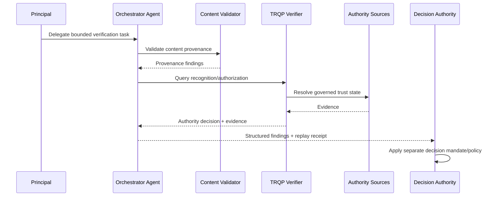

# Agent as Verifier and Orchestrator

This archetype covers an agent that invokes content validators, TRQP endpoints, registries, policy sources, and possibly other agents to assemble verification findings. The governance objective is to make the chain of delegated tool use reconstructable while preventing a verification role from silently becoming adjudication authority.

## Decision boundary

The verifier/orchestrator may produce machine-readable findings and a governed verification disposition. It may recommend or execute a downstream institutional action only if a **separate decision mandate** grants that authority.

## Plain-language summary

A principal delegates an AI agent to call provenance validators, TRQP verifiers, registries, policy services, and possibly other agents to assemble verification findings. The assurance problem is whether the orchestration itself stayed within the allowed tool, data, action, and delegation scope.

A positive result means **the agent may return bounded, replayable verification findings under the evaluated mandate**. It does not automatically authorize the downstream action those findings inform. Publication, payment, enforcement, admission, or another institutional consequence requires a separate decision mandate.

## At-a-glance governance flow

## Cross-functional interaction view

This swimlane-style interaction view makes tool-chain governance explicit by showing how a delegated verifier agent gathers findings while leaving downstream consequence to a separate authority.

## Governed decision state model

This state model keeps verification-orchestration authority bounded by distinguishing valid findings production from unapproved tool use, stale dependencies, conflicting trust state, and correction.

## Why this agentic archetype needs verifiable governance

A verifier agent can appear trustworthy while silently expanding its role: selecting an unapproved data source, invoking a prohibited sub-agent, changing policy inputs, or directly executing a downstream action. Those risks are not resolved by validating the agent’s identity.

The walkthrough therefore treats the tool chain as evidence. Material calls, dependency identities, policy/trust-state epochs, failure behavior, and final findings can be reconstructed. This allows an independent reviewer to distinguish evidence gathering from the authority to impose a consequence.

## Roles in the workflow

| Actor | Authority or responsibility |
|---|---|
| Principal | Delegates verification/orchestration task and defines allowed tools/data/actions |
| Verifier/orchestrator agent | Calls approved dependencies and assembles bounded findings |
| Tool/registry providers | Return provenance, recognition, authorization, revocation or policy evidence |
| TRQP verifier | Produces authority decisions from governed trust sources |
| Decision authority | Separately decides publication, payment, enforcement, admission, or other consequence |

## Agent governance concepts mapped to verifier controls

| Agent governance concept | Verifier concept | Practical meaning |
|---|---|---|
| Verification mandate | Delegation evidence | Defines the bounded orchestration task |
| Approved tool list | Tool/action scope | Restricts which validators, registries, and agents may be invoked |
| Material call evidence | Replay surface | Records inputs/outputs that affected the result |
| Dependency freshness/conflict | Trust-state evidence | Prevents stale or incompatible inputs being silently normalized |
| Separate decision mandate | Authority boundary | Prevents verifier authority becoming downstream decision authority |

## Tool-chain evidence

A replayable orchestration record should identify:

- agent and principal;
- mandate and permitted tool/action scope;
- tool or downstream-agent identities;
- request and response digests or stable evidence references;
- policy/trust-state epochs;
- order of material calls where order affects outcome;
- failure and retry behavior; and
- final findings and reason codes.

## End-to-end flow

## Assurance tests

Test unauthorized tool invocation, prohibited downstream-agent delegation, stale dependency evidence, conflicting authority sources, tool failure, replay from pinned outputs, and an attempted transition from verifier role to a downstream action without a separate decision mandate.

## What evidence is produced

| Evidence artifact | Primary user | What it establishes |
|---|---|---|
| Normalized verification request | Implementer / reviewer | Which actor, resource, action, context, and evidence entered the decision |
| Decision receipt | Relying party / affected party | Outcome, reason codes, policy epoch, and the bounded basis for the decision |
| Authority and revocation references | Assurance reviewer | Which governed trust sources were relied upon and their evaluated state |
| Replay inputs or audit bundle | Auditor / maintainer | Whether the original decision can be reconstructed from pinned evidence |
| Superseding receipt or correction lineage | Reviewer / affected party | How a material correction changed a later decision without rewriting history |

## What can be tested

| Test question | Artifact or command |
|---|---|
| Do the walkthrough diagrams and required reader-facing sections pass quality validation? | `python scripts/validate_walkthrough_quality.py` |
| Do Mermaid flow, interaction, and state diagrams pass structural validation? | `python scripts/validate_walkthrough_diagrams.py` |
| Do machine-readable walkthrough manifests contain the common lifecycle cases? | `python scripts/validate_walkthrough_examples.py` |
| Do agentic mandate, scope, revocation, and role-boundary requirements remain aligned? | `python scripts/validate_agentic_assurance.py` |
| Do shipped example artefacts remain structurally valid? | `python scripts/validate_examples.py` |
| Does the complete repository validation surface pass? | `make validate` |

## Why this improves adoption

This walkthrough is easier to adopt when the governance value is expressed in familiar operational terms:

- organizations can use agentic orchestration without making the agent an unbounded decision-maker;
- auditors can reconstruct which tools and authority sources shaped the findings;
- dependency failure and conflict remain visible instead of being coerced into a positive result;
- downstream systems can require an explicit second authority before executing consequential actions.

## Governance interpretation

The architecture deliberately separates **authority to verify** from **authority to decide**. The principal may delegate evidence gathering and policy evaluation to an agent, but the institution that owns the downstream consequence retains its own decision right unless it explicitly delegates that right.

This makes orchestration governable: tools are scoped, authority can be revoked, evidence is replayable, and role expansion becomes testable rather than implicit.

## Operational assurance contract

| Control point | Required behavior | Evidence |
|---|---|---|
| Decision | Evaluate verification/orchestration authority and produce bounded findings | Stable findings and reason codes |
| Authority | Resolve agent mandate plus tool/delegation scope | Mandate and tool authorization references |
| Freshness | Pin material trust and policy inputs | Timestamped evidence/digests |
| Policy | Preserve verifier policy separately from downstream decision policy | Policy identifiers/digests |
| Failure | Surface unavailable/conflicting dependencies explicitly | `review`/`indeterminate` findings |
| Correction | Supersede earlier receipts when material inputs change | Receipt lineage |
| Handoff | Require distinct authority for substantive downstream action | Decision-authority reference |

### Conformance assertions

1. verifier authority does not imply downstream decision authority;
2. unapproved tools or agents cannot be invoked under the verification mandate;
3. material calls are evidenced sufficiently for deterministic replay;
4. dependency uncertainty is not coerced into `allow`; and
5. an independent reviewer can distinguish source evidence, verifier findings, policy evaluation, and final institutional action.
