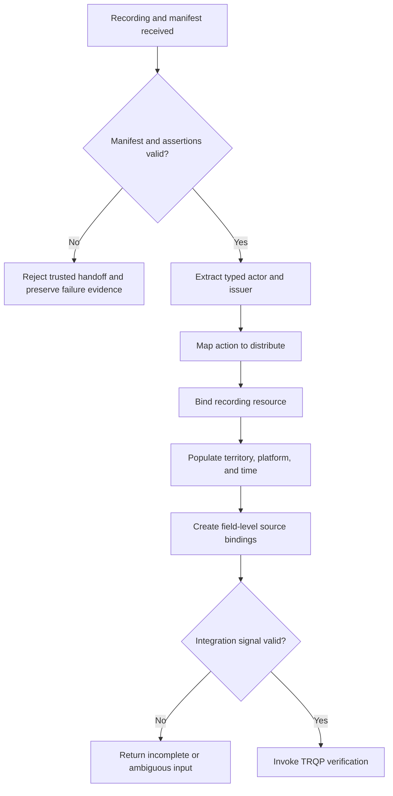
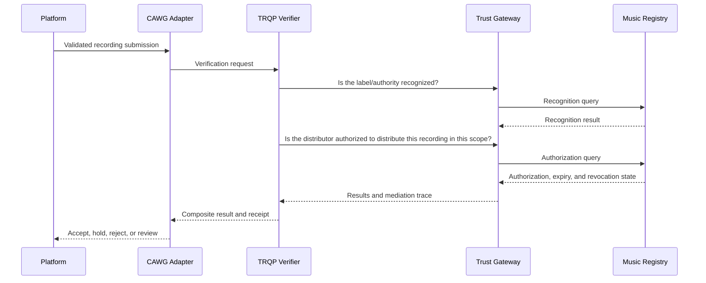

# Authorized Music Distribution Walkthrough

This walkthrough shows how a platform can combine CAWG/C2PA provenance evidence with TRQP recognition and authorization to decide whether a distributor is authorized to deliver a recording.

The workflow is illustrative and non-normative. It does not determine copyright ownership or replace contracts.

## Actors

| Actor | Responsibility |
|---|---|
| Label | Issues scoped distributor authority |
| Distributor | Submits the recording and provenance evidence |
| Platform | Makes the final operational decision |
| CAWG/C2PA validator | Validates the asset, manifest, and assertions |
| CAWG adapter | Produces the normalized integration signal |
| TRQP verifier | Evaluates recognition and authorization |
| Trust gateway | Routes to the correct sector registry |
| Registry | Supplies current policy, recognition, and revocation state |
| Auditor | Replays the evidence |

## Step 1: Publish scoped authority

The label publishes an authorization record bounded by:

- distributor;
- recording or catalogue;
- action;
- territory;
- platform;
- effective period;
- delegation rights;
- revocation state.

## Step 2: Submit content and provenance

The distributor submits the recording with CAWG/C2PA evidence that identifies the submitting actor, relevant issuer, asset identifier, and declared action.

## Step 3: Validate and normalize

The CAWG/C2PA validator checks signatures, integrity, assertion bindings, and validation status. The adapter then produces a schema-valid CAWG-TRQP integration signal.

## Step 4: Run TRQP verification

The platform or adapter invokes `POST /trqp/verify`. The verifier performs recognition and authorization, directly or through the trust gateway.

## Step 5: Apply platform disposition

The platform retains final decision authority.

| Verification result | Platform disposition |
|---|---|
| Authorized | Continue ingestion |
| Scope mismatch | Hold for corrected scope or evidence |
| Unknown | Request additional evidence |
| Expired | Reject or hold according to policy |
| Revoked | Reject and preserve evidence |
| Conflicting | Quarantine and escalate |
| Stale | Re-query using the freshness policy |
| Unavailable | Apply documented failure behavior |
| Invalid CAWG evidence | Route to forensic/manual review |

## Step 6: Produce evidence

The verifier returns a decision receipt containing:

- normalized request summary;
- recognition result;
- authorization result;
- policy and revocation evidence;
- cache and freshness evidence;
- gateway mediation trace where applicable;
- reason codes;
- verifier and profile versions.

For audit or appeal, the platform requests an audit bundle and verifies deterministic replay.

## Step 7: Appeal and correction

A distributor must be able to challenge an unknown, expired, revoked, or scope-mismatch result. The review process should identify whether the error arose from:

- CAWG assertion extraction;
- identifier resolution;
- registry state;
- gateway routing;
- stale cache;
- revocation error;
- incorrect platform policy.

Correction should update the authoritative source and produce a new independently replayable decision, rather than editing the historical receipt.

## Complete wiring checklist

- [ ] CAWG assertion sources for actor, issuer, action, and resource are specified.
- [ ] The integration signal validates against the repository schema.
- [ ] Every derived field has a source binding.
- [ ] The `distribute` action and recording resource are versioned semantics.
- [ ] Territory, platform, and effective time are present.
- [ ] Recognition and authorization routes are configured.
- [ ] Expiry and revocation are exercised.
- [ ] Cache freshness behavior is declared.
- [ ] Decision receipts include reason and provenance evidence.
- [ ] Audit bundles replay.
- [ ] Unknown and indeterminate states are not treated as infringement findings.
- [ ] Appeal and correction can restore a valid actor.

See the [CAWG Implementation Playbook](../industry-adoption/cawg-implementation-playbook.md), [Application Profile](../industry-adoption/music-industry-application-profile.md), and [Pilot Blueprint](../industry-adoption/music-industry-pilot-blueprint.md).
