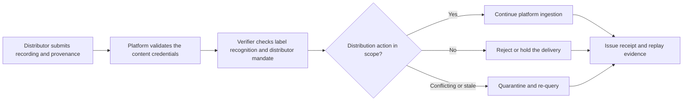
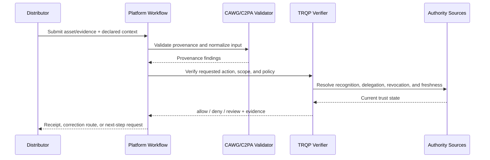
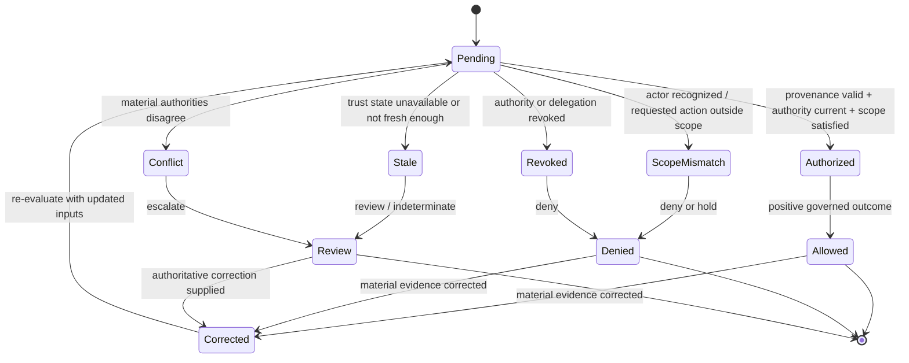
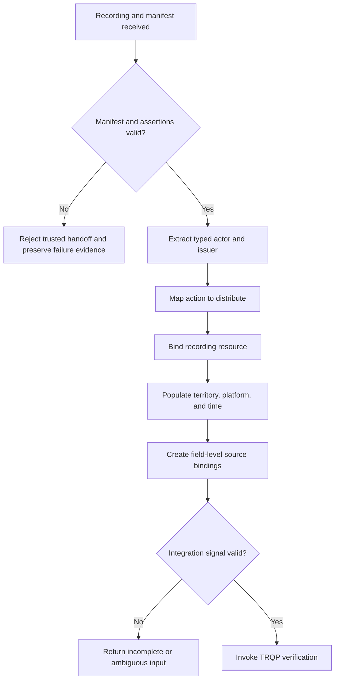
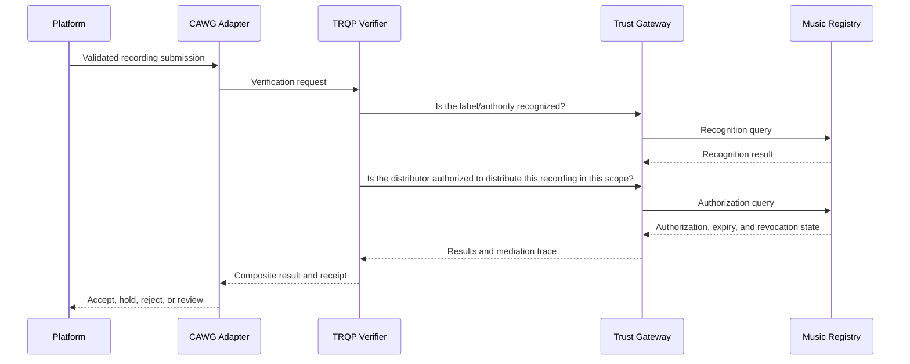

# Authorized Music Distribution Walkthrough

This walkthrough shows how a platform can combine CAWG/C2PA provenance evidence with TRQP recognition and authorization to decide whether a distributor is authorized to deliver a recording.

The workflow is illustrative and non-normative. It does not determine copyright ownership or replace contracts.

## At-a-glance governance flow

```mermaid
flowchart LR
    A[Distributor submits recording and provenance] --> B[Platform validates the content credentials]
    B --> C[Verifier checks label recognition and distributor mandate]
    C --> D{Distribution action in scope?}
    D -- Yes --> E[Continue platform ingestion]
    D -- No --> F[Reject or hold the delivery]
    D -- Conflicting or stale --> G[Quarantine and re-query]
    E --> H[Issue receipt and replay evidence]
    F --> H
    G --> H
```

The overview distinguishes scoped distribution authority from copyright ownership and contractual rights.

## Cross-functional interaction view

This swimlane-style interaction view shows how evidence moves between the submitting actor, the relying workflow, provenance validation, governed authority resolution, and the bounded operational decision.

```mermaid
sequenceDiagram
    participant S as Distributor
    participant W as Platform Workflow
    participant C as CAWG/C2PA Validator
    participant V as TRQP Verifier
    participant A as Authority Sources

    S->>W: Submit asset/evidence + declared context
    W->>C: Validate provenance and normalize input
    C-->>W: Provenance findings
    W->>V: Verify requested action, scope, and policy
    V->>A: Resolve recognition, delegation, revocation, and freshness
    A-->>V: Current trust state
    V-->>W: allow / deny / review + evidence
    W-->>S: Receipt, correction route, or next-step request
```

## Governed decision state model

This state model keeps the governance lifecycle explicit so authorization, scope failure, revocation, stale trust state, conflict, and superseding correction are visible rather than collapsed into a single pass/fail result.

```mermaid
stateDiagram-v2
    [*] --> Pending

    Pending --> Authorized: provenance valid + authority current + scope satisfied
    Pending --> ScopeMismatch: actor recognized / requested action outside scope
    Pending --> Revoked: authority or delegation revoked
    Pending --> Stale: trust state unavailable or not fresh enough
    Pending --> Conflict: material authorities disagree

    Authorized --> Allowed: positive governed outcome
    ScopeMismatch --> Denied: deny or hold
    Revoked --> Denied: deny
    Stale --> Review: review / indeterminate
    Conflict --> Review: escalate

    Allowed --> Corrected: material evidence corrected
    Denied --> Corrected: material evidence corrected
    Review --> Corrected: authoritative correction supplied

    Corrected --> Pending: re-evaluate with updated inputs

    Allowed --> [*]
    Denied --> [*]
    Review --> [*]
```

## Actors

| Actor | Responsibility |
|---|---|
| Label | Issues scoped distributor authority |
| Distributor | Submits the recording and provenance evidence |
| Platform | Makes the final operational decision |
| CAWG/C2PA validator | Validates the asset, manifest, and assertions |
| CAWG adapter | Produces the normalized integration signal |
| TRQP verifier | Evaluates recognition and authorization |
| Trust gateway | Routes to the correct sector registry |
| Registry | Supplies current policy, recognition, and revocation state |
| Auditor | Replays the evidence |

## Step 1: Publish scoped authority

The label publishes an authorization record bounded by:

- distributor;
- recording or catalogue;
- action;
- territory;
- platform;
- effective period;
- delegation rights;
- revocation state.

## Step 2: Submit content and provenance

The distributor submits the recording with CAWG/C2PA evidence that identifies the submitting actor, relevant issuer, asset identifier, and declared action.

## Step 3: Validate and normalize

The CAWG/C2PA validator checks signatures, integrity, assertion bindings, and validation status. The adapter then produces a schema-valid CAWG-TRQP integration signal.

```mermaid
flowchart TD
    A[Recording and manifest received] --> B{Manifest and assertions valid?}
    B -- No --> X[Reject trusted handoff and preserve failure evidence]
    B -- Yes --> C[Extract typed actor and issuer]
    C --> D[Map action to distribute]
    D --> E[Bind recording resource]
    E --> F[Populate territory, platform, and time]
    F --> G[Create field-level source bindings]
    G --> H{Integration signal valid?}
    H -- No --> Y[Return incomplete or ambiguous input]
    H -- Yes --> I[Invoke TRQP verification]
```

## Step 4: Run TRQP verification

The platform or adapter invokes `POST /trqp/verify`. The verifier performs recognition and authorization, directly or through the trust gateway.

```mermaid
sequenceDiagram
    participant P as Platform
    participant C as CAWG Adapter
    participant V as TRQP Verifier
    participant G as Trust Gateway
    participant R as Music Registry

    P->>C: Validated recording submission
    C->>V: Verification request
    V->>G: Is the label/authority recognized?
    G->>R: Recognition query
    R-->>G: Recognition result
    V->>G: Is the distributor authorized to distribute this recording in this scope?
    G->>R: Authorization query
    R-->>G: Authorization, expiry, and revocation state
    G-->>V: Results and mediation trace
    V-->>C: Composite result and receipt
    C-->>P: Accept, hold, reject, or review
```

## Step 5: Apply platform disposition

The platform retains final decision authority.

| Verification result | Platform disposition |
|---|---|
| Authorized | Continue ingestion |
| Scope mismatch | Hold for corrected scope or evidence |
| Unknown | Request additional evidence |
| Expired | Reject or hold according to policy |
| Revoked | Reject and preserve evidence |
| Conflicting | Quarantine and escalate |
| Stale | Re-query using the freshness policy |
| Unavailable | Apply documented failure behavior |
| Invalid CAWG evidence | Route to forensic/manual review |

## Step 6: Produce evidence

The verifier returns a decision receipt containing:

- normalized request summary;
- recognition result;
- authorization result;
- policy and revocation evidence;
- cache and freshness evidence;
- gateway mediation trace where applicable;
- reason codes;
- verifier and profile versions.

For audit or appeal, the platform requests an audit bundle and verifies deterministic replay.

## Step 7: Appeal and correction

A distributor must be able to challenge an unknown, expired, revoked, or scope-mismatch result. The review process should identify whether the error arose from:

- CAWG assertion extraction;
- identifier resolution;
- registry state;
- gateway routing;
- stale cache;
- revocation error;
- incorrect platform policy.

Correction should update the authoritative source and produce a new independently replayable decision, rather than editing the historical receipt.

## Complete wiring checklist

- [ ] CAWG assertion sources for actor, issuer, action, and resource are specified.
- [ ] The integration signal validates against the repository schema.
- [ ] Every derived field has a source binding.
- [ ] The `distribute` action and recording resource are versioned semantics.
- [ ] Territory, platform, and effective time are present.
- [ ] Recognition and authorization routes are configured.
- [ ] Expiry and revocation are exercised.
- [ ] Cache freshness behavior is declared.
- [ ] Decision receipts include reason and provenance evidence.
- [ ] Audit bundles replay.
- [ ] Unknown and indeterminate states are not treated as infringement findings.
- [ ] Appeal and correction can restore a valid actor.

See the [CAWG Implementation Playbook](../industry-adoption/cawg-implementation-playbook.md), [Application Profile](../industry-adoption/music-industry-application-profile.md), and [Pilot Blueprint](../industry-adoption/music-industry-pilot-blueprint.md).

## Agentic AI Variant

Introducing an agent into **Authorized Music Distribution Walkthrough** changes the assurance problem from actor recognition alone to delegated-action assurance. Apply the common [Agentic AI Assurance model](../agentic-ai/index.md) and treat agent identity as necessary but insufficient evidence.

| Agentic control | Walkthrough requirement |
|---|---|
| Agent role | Model the agent explicitly as **production/mastering agent, rights-holder submitter, verifier, distributor orchestrator, or licensing assistant**; authority in one role MUST NOT imply authority in another. |
| Principal | Bind the agent to **artist, label, publisher, distributor, collective, or rights holder** and retain the principal reference in the decision evidence. |
| Delegated authority | Verify a mandate for the exact requested operation; authentication or recognition of the agent alone is not authorization. |
| Scope | Enforce **recording/work, territory, distribution channel, rights class, release window, transformation/derivative permission, and delegation depth** as applicable to the transaction. |
| Tool/sub-agent chain | Where the agent invokes tools or downstream agents, retain evidence of material calls and reject unauthorized sub-delegation. |
| Revocation | Evaluate principal and delegation state at the decision time; revoked or expired authority cannot authorize a new action. |
| Failure | Preserve explicit `deny`, `review`, and `indeterminate` outcomes rather than coercing uncertainty into permission. |
| Audit and redress | Retain agent, principal, mandate, policy epoch, provenance/authority evidence, and a correction or challenge route sufficient for replay. |

An agent authorized to deliver a recording is not automatically authorized to license rights, modify ownership metadata, create derivatives, or decide royalty entitlement.

### Agentic conformance probes

In addition to the walkthrough's existing tests, exercise an authenticated agent with no mandate, a valid mandate with an out-of-scope action, revoked/expired delegation, prohibited sub-delegation or tool use, stale/conflicting authority state, and a corrected input that requires a superseding receipt.

## Operational assurance contract

This walkthrough is testable as a bounded governance decision rather than as a claim that the underlying content is true.

| Control point | Required behavior | Evidence |
|---|---|---|
| Decision | Evaluate **Distribution authorization** only | Stable outcome and reason code |
| Authority | Resolve rights holder or delegated distributor authority, delegation, scope, and current status | Authority and delegation references |
| Freshness | Apply the required revocation and trust-state freshness rules | Timestamped trust-state evidence |
| Policy | Pin the distribution policy epoch used for evaluation | Policy identifier/version or digest |
| Failure | Fail visibly on stale, unavailable, ambiguous, or conflicting authority state | `indeterminate`/`review` receipt rather than implicit trust |
| Correction | Preserve the original decision and issue a superseding receipt when material inputs change | Immutable receipt lineage |
| Handoff | Pass the result into **platform ingestion** without transferring accountability to the verifier | Relying-party disposition/audit reference |

### Conformance assertions

An implementation claiming this walkthrough should be able to demonstrate that:

1. recognition alone never grants the requested action when scope or delegation is absent;
2. a revoked authority or delegation cannot produce a positive decision for the affected decision time;
3. stale or conflicting trust state is surfaced explicitly and never silently coerced to `allow`;
4. identical pinned inputs replay to the same governed outcome and reason code; and
5. a correction produces a new decision linked to, rather than overwriting, the historical receipt.

