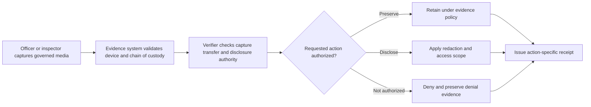
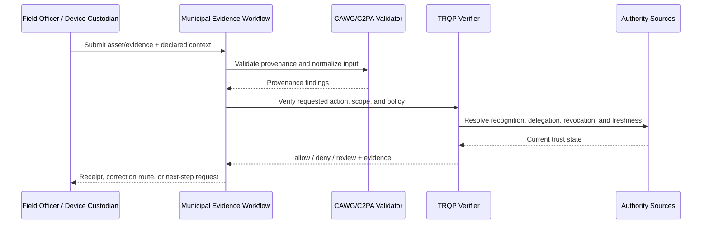
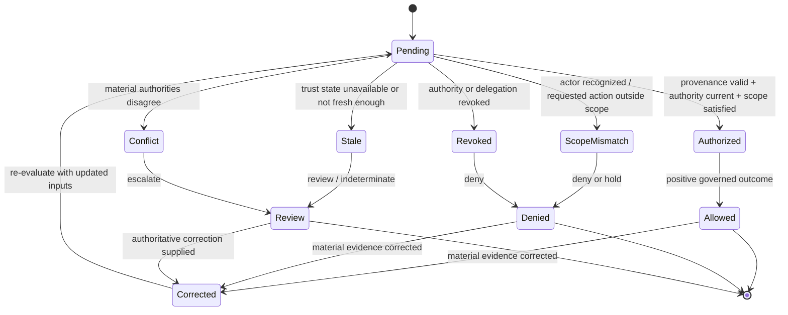

# Body-Camera and Municipal Evidence

## Purpose and decision boundary

An agency receives body-camera or field-inspection media. Authorization is evaluated separately for ingest, preservation, redaction, internal disclosure, public disclosure, and tribunal submission.

The decision is deliberately narrow:

> **May this asset be used for controlled evidence process under the authority, scope, policy, and trust state recorded at decision time?**

A successful result does not establish factual truth, legal liability, professional judgment, product authenticity, clinical validity, or entitlement beyond that scoped action.

## At-a-glance governance flow



Separate decisions govern preservation, redaction, internal access, public disclosure, and deletion.


## Cross-functional interaction view

This swimlane-style interaction view shows how evidence moves between the submitting actor, the relying workflow, provenance validation, governed authority resolution, and the bounded operational decision.



## Governed decision state model

This state model keeps the governance lifecycle explicit so authorization, scope failure, revocation, stale trust state, conflict, and superseding correction are visible rather than collapsed into a single pass/fail result.



## Actors and authority

| Role | Responsibility | Evidence expected |
|---|---|---|
| Submitter | Supplies the asset and declared context | CAWG/C2PA-derived integration signal |
| Governing authority | Defines who may perform `admit_evidence` | Signed policy and recognition information |
| Relying service | Applies the decision to its own workflow | Decision receipt and reason codes |
| Affected party | May challenge metadata, authority, or use | Correction, appeal, or redress reference |
| Assurance reviewer | Replays and audits the decision | Pinned inputs and audit bundle |

## Governance concerns

- **Chain Of Custody:** represented as explicit policy, context, evidence, or review requirements.
- **Redaction Authority:** represented as explicit policy, context, evidence, or review requirements.
- **Legal Hold:** represented as explicit policy, context, evidence, or review requirements.
- **Affected Party Challenge:** represented as explicit policy, context, evidence, or review requirements.

## End-to-end sequence

1. Validate the content-authenticity input and normalize it into the CAWG-TRQP integration signal.
2. Resolve the actor, `public-agency` authority source, and relevant delegation chain.
3. Evaluate `admit_evidence` against asset, resource, jurisdiction, purpose, and time scope.
4. Check revocation, freshness, descriptor integrity, and any profile-specific fail-closed requirements.
5. Return `allow`, `deny`, `indeterminate`, or `review` with stable reason codes.
6. Issue a decision receipt that identifies the policy epoch, authority evidence, verifier version, and evidence minimization profile.
7. Preserve replay inputs. A corrected or superseding decision creates a new receipt rather than mutating the historical record.

## Required cases

| Case | Expected outcome | Assurance point |
|---|---|---|
| Authorized and in scope | `allow` | Positive path is reproducible |
| Recognized but scope mismatch | `deny` | Recognition is not authorization |
| Revoked authority | `deny` | Revocation is enforced |
| Stale or unavailable authority state | `indeterminate` or `review` | Missing evidence never silently becomes trusted |
| Conflicting authorities | `review` | Conflict is visible and routed |
| Corrected metadata | new decision | History remains immutable and auditable |

## Runnable evidence package

The companion directory [`examples/body-camera-evidence/`](../../examples/body-camera-evidence/README.md) contains a machine-readable scenario manifest and expected outcomes. Run:

```bash
python scripts/validate_walkthrough_examples.py
```

## Evidence produced

- scoped decision and stable reason codes;
- authority, delegation, and revocation evidence references;
- policy and context-profile versions;
- minimized decision receipt;
- replay inputs and correction lineage; and
- an explicit review or redress route for contested decisions.

## What this walkthrough does not prove

This walkthrough does not convert provenance into truth and does not transfer institutional accountability to the verifier. The relying organization remains responsible for the lawful, proportionate, and procedurally fair use of the result.

## Agentic AI Variant

Introducing an agent into **Body-Camera and Municipal Evidence** changes the assurance problem from actor recognition alone to delegated-action assurance. Apply the common [Agentic AI Assurance model](../agentic-ai/index.md) and treat agent identity as necessary but insufficient evidence.

| Agentic control | Walkthrough requirement |
|---|---|
| Agent role | Model the agent explicitly as **capture agent, evidence-ingest agent, verifier, or disclosure/workflow orchestrator**; authority in one role MUST NOT imply authority in another. |
| Principal | Bind the agent to **law-enforcement agency, officer, evidence custodian, prosecutor, or authorized oversight body** and retain the principal reference in the decision evidence. |
| Delegated authority | Verify a mandate for the exact requested operation; authentication or recognition of the agent alone is not authorization. |
| Scope | Enforce **device/officer assignment, incident, evidence operation, disclosure purpose, retention state, and time window** as applicable to the transaction. |
| Tool/sub-agent chain | Where the agent invokes tools or downstream agents, retain evidence of material calls and reject unauthorized sub-delegation. |
| Revocation | Evaluate principal and delegation state at the decision time; revoked or expired authority cannot authorize a new action. |
| Failure | Preserve explicit `deny`, `review`, and `indeterminate` outcomes rather than coercing uncertainty into permission. |
| Audit and redress | Retain agent, principal, mandate, policy epoch, provenance/authority evidence, and a correction or challenge route sufficient for replay. |

Agentic verification cannot determine legality of conduct, evidentiary weight, guilt, or disclosure entitlement unless those decisions are separately authorized and reviewable.

### Agentic conformance probes

In addition to the walkthrough's existing tests, exercise an authenticated agent with no mandate, a valid mandate with an out-of-scope action, revoked/expired delegation, prohibited sub-delegation or tool use, stale/conflicting authority state, and a corrected input that requires a superseding receipt.

## Operational assurance contract

This walkthrough is testable as a bounded governance decision rather than as a claim that the underlying content is true.

| Control point | Required behavior | Evidence |
|---|---|---|
| Decision | Evaluate **Evidence-ingest acceptance** only | Stable outcome and reason code |
| Authority | Resolve agency evidence authority, delegation, scope, and current status | Authority and delegation references |
| Freshness | Apply the required revocation and trust-state freshness rules | Timestamped trust-state evidence |
| Policy | Pin the evidence handling policy epoch used for evaluation | Policy identifier/version or digest |
| Failure | Fail visibly on stale, unavailable, ambiguous, or conflicting authority state | `indeterminate`/`review` receipt rather than implicit trust |
| Correction | Preserve the original decision and issue a superseding receipt when material inputs change | Immutable receipt lineage |
| Handoff | Pass the result into **municipal evidence workflow** without transferring accountability to the verifier | Relying-party disposition/audit reference |

### Conformance assertions

An implementation claiming this walkthrough should be able to demonstrate that:

1. recognition alone never grants the requested action when scope or delegation is absent;
2. a revoked authority or delegation cannot produce a positive decision for the affected decision time;
3. stale or conflicting trust state is surfaced explicitly and never silently coerced to `allow`;
4. identical pinned inputs replay to the same governed outcome and reason code; and
5. a correction produces a new decision linked to, rather than overwriting, the historical receipt.

