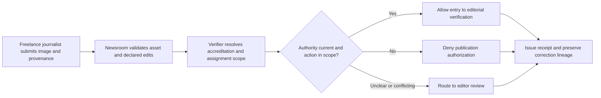

# Breaking-News Photography

## Purpose and decision boundary

A freelance journalist submits urgent imagery to a newsroom. The newsroom must decide whether the asset may enter publication workflow without treating provenance as proof that the depicted claim is true.

The decision is deliberately narrow:

> **May this asset be used for authenticated reporting under the authority, scope, policy, and trust state recorded at decision time?**

A successful result does not establish factual truth, legal liability, professional judgment, product authenticity, clinical validity, or entitlement beyond that scoped action.

## At-a-glance governance flow



The flow separates provenance and scoped publication authority from the newsroom's independent duty to verify the underlying claim.

## Actors and authority

| Role | Responsibility | Evidence expected |
|---|---|---|
| Submitter | Supplies the asset and declared context | CAWG/C2PA-derived integration signal |
| Governing authority | Defines who may perform `publish` | Signed policy and recognition information |
| Relying service | Applies the decision to its own workflow | Decision receipt and reason codes |
| Affected party | May challenge metadata, authority, or use | Correction, appeal, or redress reference |
| Assurance reviewer | Replays and audits the decision | Pinned inputs and audit bundle |

## Governance concerns

- **Source Protection:** represented as explicit policy, context, evidence, or review requirements.
- **Assignment Scope:** represented as explicit policy, context, evidence, or review requirements.
- **Declared Editorial Transformations:** represented as explicit policy, context, evidence, or review requirements.
- **Post Publication Correction:** represented as explicit policy, context, evidence, or review requirements.

## End-to-end sequence

1. Validate the content-authenticity input and normalize it into the CAWG-TRQP integration signal.
2. Resolve the actor, `newsroom` authority source, and relevant delegation chain.
3. Evaluate `publish` against asset, resource, jurisdiction, purpose, and time scope.
4. Check revocation, freshness, descriptor integrity, and any profile-specific fail-closed requirements.
5. Return `allow`, `deny`, `indeterminate`, or `review` with stable reason codes.
6. Issue a decision receipt that identifies the policy epoch, authority evidence, verifier version, and evidence minimization profile.
7. Preserve replay inputs. A corrected or superseding decision creates a new receipt rather than mutating the historical record.

## Required cases

| Case | Expected outcome | Assurance point |
|---|---|---|
| Authorized and in scope | `allow` | Positive path is reproducible |
| Recognized but scope mismatch | `deny` | Recognition is not authorization |
| Revoked authority | `deny` | Revocation is enforced |
| Stale or unavailable authority state | `indeterminate` or `review` | Missing evidence never silently becomes trusted |
| Conflicting authorities | `review` | Conflict is visible and routed |
| Corrected metadata | new decision | History remains immutable and auditable |

## Runnable evidence package

The companion directory [`examples/breaking-news-photography/`](../../examples/breaking-news-photography/README.md) contains a machine-readable scenario manifest and expected outcomes. Run:

```bash
python scripts/validate_walkthrough_examples.py
```

## Evidence produced

- scoped decision and stable reason codes;
- authority, delegation, and revocation evidence references;
- policy and context-profile versions;
- minimized decision receipt;
- replay inputs and correction lineage; and
- an explicit review or redress route for contested decisions.

## What this walkthrough does not prove

This walkthrough does not convert provenance into truth and does not transfer institutional accountability to the verifier. The relying organization remains responsible for the lawful, proportionate, and procedurally fair use of the result.
