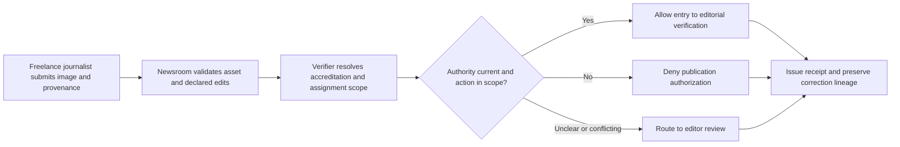
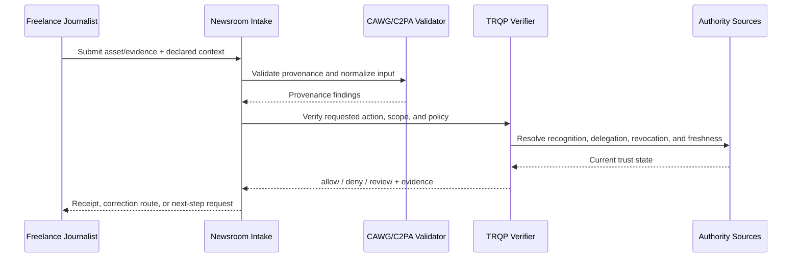
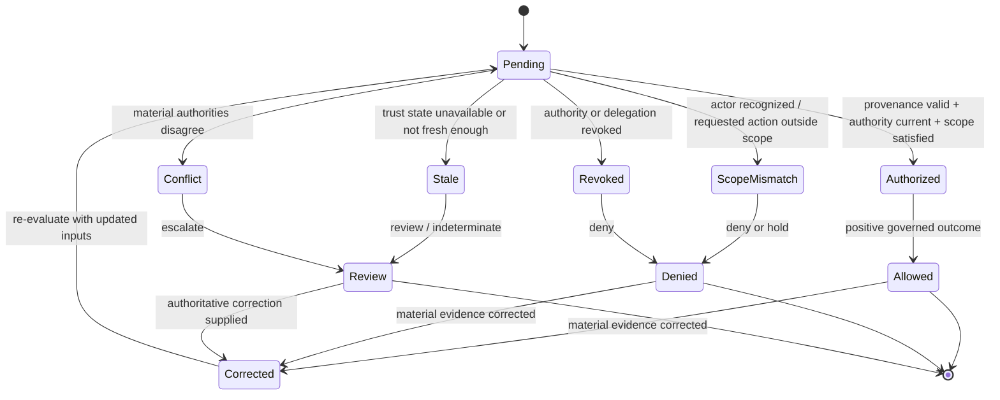

# Breaking-News Photography

## Purpose and decision boundary

A freelance journalist submits urgent imagery to a newsroom. The newsroom must decide whether the asset may enter publication workflow without treating provenance as proof that the depicted claim is true.

The decision is deliberately narrow:

> **May this asset be used for authenticated reporting under the authority, scope, policy, and trust state recorded at decision time?**

A successful result does not establish factual truth, legal liability, professional judgment, product authenticity, clinical validity, or entitlement beyond that scoped action.

## Plain-language summary

A freelance journalist sends an image to a newsroom during a fast-moving event. Before the image can enter the editorial workflow, the newsroom needs more than a valid provenance record: it needs to know whether the journalist is recognized for this assignment, whether the requested publication action is within scope, whether that authority is still current, and whether any material correction has changed the decision surface.

A positive verifier result therefore means **the image may proceed into editorial verification under the recorded authority and policy state**. It does not mean the depicted event is true. Editors still have to establish context, corroborate claims, assess newsworthiness, and take responsibility for publication. The value of CAWG-TRQP is that the authorization decision becomes explicit, reproducible, and challengeable rather than being buried in newsroom memory or ad hoc account permissions.

## At-a-glance governance flow



The flow separates provenance and scoped publication authority from the newsroom's independent duty to verify the underlying claim.


## Cross-functional interaction view

This swimlane-style interaction view shows how evidence moves between the submitting actor, the relying workflow, provenance validation, governed authority resolution, and the bounded operational decision.



## Governed decision state model

This state model keeps the governance lifecycle explicit so authorization, scope failure, revocation, stale trust state, conflict, and superseding correction are visible rather than collapsed into a single pass/fail result.



## Why this workflow needs verifiable governance

Breaking news compresses the time available for verification while increasing the cost of a mistaken trust decision. Accreditation can expire, a photographer may be recognized but outside the assigned event, a source may need protection, and an image can carry authentic provenance while still being contextually misleading. Those are different questions and should not be collapsed into a single “verified” badge.

The verifier provides a governed checkpoint between provenance validation and editorial judgment. It makes assignment authority, publication scope, revocation, freshness, and conflicting authority state visible to the newsroom. This is especially useful when material arrives through multiple desks, agencies, freelancers, or automated intake systems and the person making the downstream editorial decision was not present when the authority was granted.

## Roles in the workflow
| Role | Responsibility | Evidence expected |
|---|---|---|
| Submitter | Supplies the asset and declared context | CAWG/C2PA-derived integration signal |
| Governing authority | Defines who may perform `publish` | Signed policy and recognition information |
| Relying service | Applies the decision to its own workflow | Decision receipt and reason codes |
| Affected party | May challenge metadata, authority, or use | Correction, appeal, or redress reference |
| Assurance reviewer | Replays and audits the decision | Pinned inputs and audit bundle |


## System components mapped to workflow concepts

| Workflow concept | Verifier concept | Practical meaning |
|---|---|---|
| Press accreditation or assignment | Recognition/delegation evidence | Shows why the journalist may act for this event or newsroom |
| Publication permission | Scoped authorization | Binds `publish` to the asset, assignment, channel, time and purpose |
| Credential/assignment withdrawal | Revocation state | Prevents a withdrawn mandate from authorizing a new publication action |
| Editorial correction | Superseding decision receipt | Preserves the original decision while recording corrected inputs |
| Editor escalation | `review` / `indeterminate` outcome | Keeps uncertainty visible instead of converting it into permission |
## Governance concerns

- **Source Protection:** represented as explicit policy, context, evidence, or review requirements.
- **Assignment Scope:** represented as explicit policy, context, evidence, or review requirements.
- **Declared Editorial Transformations:** represented as explicit policy, context, evidence, or review requirements.
- **Post Publication Correction:** represented as explicit policy, context, evidence, or review requirements.

## End-to-end sequence

1. Validate the content-authenticity input and normalize it into the CAWG-TRQP integration signal.
2. Resolve the actor, `newsroom` authority source, and relevant delegation chain.
3. Evaluate `publish` against asset, resource, jurisdiction, purpose, and time scope.
4. Check revocation, freshness, descriptor integrity, and any profile-specific fail-closed requirements.
5. Return `allow`, `deny`, `indeterminate`, or `review` with stable reason codes.
6. Issue a decision receipt that identifies the policy epoch, authority evidence, verifier version, and evidence minimization profile.
7. Preserve replay inputs. A corrected or superseding decision creates a new receipt rather than mutating the historical record.

## Required cases

| Case | Expected outcome | Assurance point |
|---|---|---|
| Authorized and in scope | `allow` | Positive path is reproducible |
| Recognized but scope mismatch | `deny` | Recognition is not authorization |
| Revoked authority | `deny` | Revocation is enforced |
| Stale or unavailable authority state | `indeterminate` or `review` | Missing evidence never silently becomes trusted |
| Conflicting authorities | `review` | Conflict is visible and routed |
| Corrected metadata | new decision | History remains immutable and auditable |

## Runnable evidence package

The companion directory [`examples/breaking-news-photography/`](../../examples/breaking-news-photography/README.md) contains a machine-readable scenario manifest and expected outcomes. Run:

```bash
python scripts/validate_walkthrough_examples.py
```

## What evidence is produced

- scoped decision and stable reason codes;
- authority, delegation, and revocation evidence references;
- policy and context-profile versions;
- minimized decision receipt;
- replay inputs and correction lineage; and
- an explicit review or redress route for contested decisions.

## What this walkthrough does not prove

This walkthrough does not convert provenance into truth and does not transfer institutional accountability to the verifier. The relying organization remains responsible for the lawful, proportionate, and procedurally fair use of the result.

## What can be tested

| Test question | Artifact or command |
|---|---|
| Do the walkthrough diagrams and required reader-facing sections pass quality validation? | `python scripts/validate_walkthrough_quality.py` |
| Do Mermaid flow, interaction, and state diagrams pass structural validation? | `python scripts/validate_walkthrough_diagrams.py` |
| Do machine-readable walkthrough manifests contain the common lifecycle cases? | `python scripts/validate_walkthrough_examples.py` |
| Do shipped example artefacts remain structurally valid? | `python scripts/validate_examples.py` |
| Does the complete repository validation surface pass? | `make validate` |

## Why this improves adoption

This walkthrough is easier to adopt when the governance value is expressed in familiar operational terms:

- freelancers receive explainable authorization outcomes instead of opaque account-level rejection;
- editors can distinguish provenance findings from publication authority and factual verification;
- newsrooms can enforce withdrawn or narrowed assignments consistently across desks and systems;
- assurance reviewers can replay which authority, policy epoch, and evidence produced the original result.

## Governance interpretation

The newsroom remains the decision authority for publication. The verifier does not become an editor and the registry does not become an arbiter of truth. Authority is deliberately layered: an accreditation or assignment source says who may act, the verifier evaluates that authority against the requested publication action, and the newsroom decides what the result means for editorial workflow.

That separation is the governance benefit. It preserves institutional accountability while making the authority check executable and auditable.

## Agentic AI Variant

Introducing an agent into **Breaking-News Photography** changes the assurance problem from actor recognition alone to delegated-action assurance. Apply the common [Agentic AI Assurance model](../agentic-ai/index.md) and treat agent identity as necessary but insufficient evidence.

| Agentic control | Walkthrough requirement |
|---|---|
| Agent role | Model the agent explicitly as **capture/producer agent, newsroom submitter, verifier, or publication orchestrator**; authority in one role MUST NOT imply authority in another. |
| Principal | Bind the agent to **photographer, newsroom, editor, or publisher** and retain the principal reference in the decision evidence. |
| Delegated authority | Verify a mandate for the exact requested operation; authentication or recognition of the agent alone is not authorization. |
| Scope | Enforce **assignment/event, source asset, transformation class, publication channel, geography, and time window** as applicable to the transaction. |
| Tool/sub-agent chain | Where the agent invokes tools or downstream agents, retain evidence of material calls and reject unauthorized sub-delegation. |
| Revocation | Evaluate principal and delegation state at the decision time; revoked or expired authority cannot authorize a new action. |
| Failure | Preserve explicit `deny`, `review`, and `indeterminate` outcomes rather than coercing uncertainty into permission. |
| Audit and redress | Retain agent, principal, mandate, policy epoch, provenance/authority evidence, and a correction or challenge route sufficient for replay. |

An agent can verify provenance and assignment authority, but editorial truth, newsworthiness, contextual accuracy, and publication responsibility remain with the newsroom unless separately delegated.

### Agentic conformance probes

In addition to the walkthrough's existing tests, exercise an authenticated agent with no mandate, a valid mandate with an out-of-scope action, revoked/expired delegation, prohibited sub-delegation or tool use, stale/conflicting authority state, and a corrected input that requires a superseding receipt.

## Operational assurance contract

This walkthrough is testable as a bounded governance decision rather than as a claim that the underlying content is true.

| Control point | Required behavior | Evidence |
|---|---|---|
| Decision | Evaluate **Publication authorization** only | Stable outcome and reason code |
| Authority | Resolve assignment or accreditation authority, delegation, scope, and current status | Authority and delegation references |
| Freshness | Apply the required revocation and trust-state freshness rules | Timestamped trust-state evidence |
| Policy | Pin the publication policy epoch used for evaluation | Policy identifier/version or digest |
| Failure | Fail visibly on stale, unavailable, ambiguous, or conflicting authority state | `indeterminate`/`review` receipt rather than implicit trust |
| Correction | Preserve the original decision and issue a superseding receipt when material inputs change | Immutable receipt lineage |
| Handoff | Pass the result into **editorial verification** without transferring accountability to the verifier | Relying-party disposition/audit reference |

### Conformance assertions

An implementation claiming this walkthrough should be able to demonstrate that:

1. recognition alone never grants the requested action when scope or delegation is absent;
2. a revoked authority or delegation cannot produce a positive decision for the affected decision time;
3. stale or conflicting trust state is surfaced explicitly and never silently coerced to `allow`;
4. identical pinned inputs replay to the same governed outcome and reason code; and
5. a correction produces a new decision linked to, rather than overwriting, the historical receipt.

