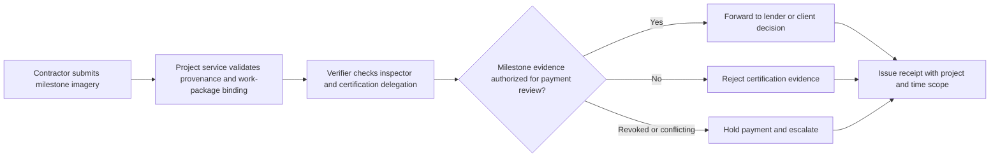
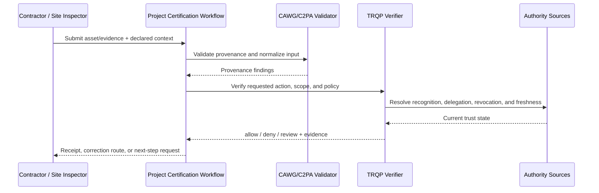
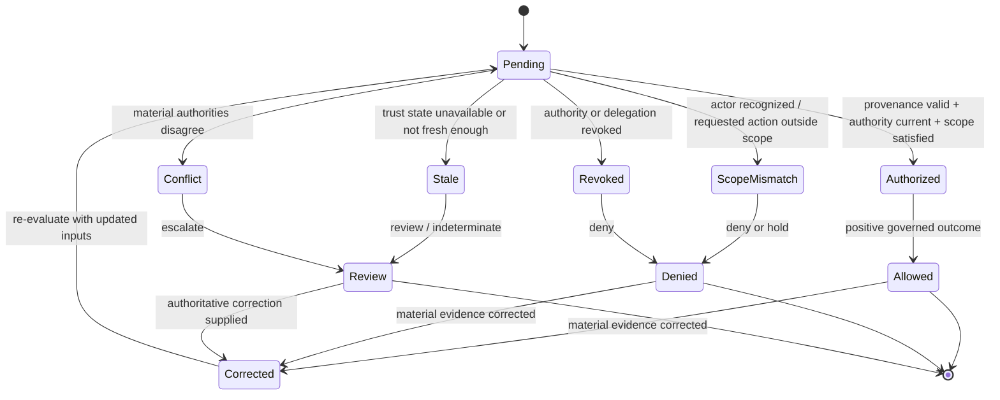

# Construction Milestone Certification

## Purpose and decision boundary

A contractor submits photographs or drone imagery to support a milestone claim. Capture authority, engineering certification authority, and payment authority are evaluated as separate delegations.

The decision is deliberately narrow:

> **May this asset be used for milestone payment review under the authority, scope, policy, and trust state recorded at decision time?**

A successful result does not establish factual truth, legal liability, professional judgment, product authenticity, clinical validity, or entitlement beyond that scoped action.

## Plain-language summary

A contractor, site inspector, or delegated professional submits imagery to support a construction milestone. The project owner needs to know whether the evidence is tied to the correct project and milestone, whether the submitting/certifying actor has the required authority, and whether that authority and evidence are current enough for milestone review.

A positive result means **the media may be used in the milestone-payment or certification workflow**. It does not prove structural compliance, workmanship quality, quantities, or payment entitlement. Those remain engineering, contractual, and financial determinations. The verifier makes the authority and evidence path into the review process explicit and auditable.

## At-a-glance governance flow



Capture authority, certification authority, and payment authority remain distinct and independently testable.


## Cross-functional interaction view

This swimlane-style interaction view shows how evidence moves between the submitting actor, the relying workflow, provenance validation, governed authority resolution, and the bounded operational decision.



## Governed decision state model

This state model keeps the governance lifecycle explicit so authorization, scope failure, revocation, stale trust state, conflict, and superseding correction are visible rather than collapsed into a single pass/fail result.



## Why this workflow needs verifiable governance

Construction programs often involve contractors, subcontractors, independent engineers, owners, lenders, and remote reviewers. The person who captures evidence may not be the person authorized to certify it, and authority may be limited to a particular site, work package, milestone, or time window.

CAWG-TRQP helps encode those distinctions. It can ensure that a recognized actor is also in scope for the requested milestone action, that revoked or expired authority is enforced, and that the evidence can be replayed later if certification or payment is disputed.

## Roles in the workflow

| Role | Responsibility | Evidence expected |
|---|---|---|
| Submitter | Supplies the asset and declared context | CAWG/C2PA-derived integration signal |
| Governing authority | Defines who may perform `release_milestone` | Signed policy and recognition information |
| Relying service | Applies the decision to its own workflow | Decision receipt and reason codes |
| Affected party | May challenge metadata, authority, or use | Correction, appeal, or redress reference |
| Assurance reviewer | Replays and audits the decision | Pinned inputs and audit bundle |


## System components mapped to workflow concepts

| Workflow concept | Verifier concept | Practical meaning |
|---|---|---|
| Project/work package | Resource scope | Binds authority to the identified construction context |
| Inspector/certifier appointment | Recognition/delegation | Shows who may submit or certify evidence |
| Milestone action | Action scope | Separates evidence submission from engineering approval or payment release |
| Appointment withdrawal | Revocation state | Prevents former delegates authorizing new actions |
| Owner/engineer escalation | Review disposition | Routes incomplete authority evidence without implying technical compliance |

## Governance concerns

- **Project And Work Package Scope:** represented as explicit policy, context, evidence, or review requirements.
- **Temporal Evidence:** represented as explicit policy, context, evidence, or review requirements.
- **Licensed Operator Status:** represented as explicit policy, context, evidence, or review requirements.
- **Revocation Before Reliance:** represented as explicit policy, context, evidence, or review requirements.

## End-to-end sequence

1. Validate the content-authenticity input and normalize it into the CAWG-TRQP integration signal.
2. Resolve the actor, `project-owner` authority source, and relevant delegation chain.
3. Evaluate `release_milestone` against asset, resource, jurisdiction, purpose, and time scope.
4. Check revocation, freshness, descriptor integrity, and any profile-specific fail-closed requirements.
5. Return `allow`, `deny`, `indeterminate`, or `review` with stable reason codes.
6. Issue a decision receipt that identifies the policy epoch, authority evidence, verifier version, and evidence minimization profile.
7. Preserve replay inputs. A corrected or superseding decision creates a new receipt rather than mutating the historical record.

## Required cases

| Case | Expected outcome | Assurance point |
|---|---|---|
| Authorized and in scope | `allow` | Positive path is reproducible |
| Recognized but scope mismatch | `deny` | Recognition is not authorization |
| Revoked authority | `deny` | Revocation is enforced |
| Stale or unavailable authority state | `indeterminate` or `review` | Missing evidence never silently becomes trusted |
| Conflicting authorities | `review` | Conflict is visible and routed |
| Corrected metadata | new decision | History remains immutable and auditable |

## Runnable evidence package

The companion directory [`examples/construction-milestone-certification/`](../../examples/construction-milestone-certification/README.md) contains a machine-readable scenario manifest and expected outcomes. Run:

```bash
python scripts/validate_walkthrough_examples.py
```

## What evidence is produced

- scoped decision and stable reason codes;
- authority, delegation, and revocation evidence references;
- policy and context-profile versions;
- minimized decision receipt;
- replay inputs and correction lineage; and
- an explicit review or redress route for contested decisions.

## What this walkthrough does not prove

This walkthrough does not convert provenance into truth and does not transfer institutional accountability to the verifier. The relying organization remains responsible for the lawful, proportionate, and procedurally fair use of the result.

## What can be tested

| Test question | Artifact or command |
|---|---|
| Do the walkthrough diagrams and required reader-facing sections pass quality validation? | `python scripts/validate_walkthrough_quality.py` |
| Do Mermaid flow, interaction, and state diagrams pass structural validation? | `python scripts/validate_walkthrough_diagrams.py` |
| Do machine-readable walkthrough manifests contain the common lifecycle cases? | `python scripts/validate_walkthrough_examples.py` |
| Do shipped example artefacts remain structurally valid? | `python scripts/validate_examples.py` |
| Does the complete repository validation surface pass? | `make validate` |

## Why this improves adoption

This walkthrough is easier to adopt when the governance value is expressed in familiar operational terms:

- project teams can distinguish capture authority from certification and payment authority;
- remote reviewers receive replayable evidence instead of only screenshots or email approvals;
- delegations can be restricted by site, milestone, action, and validity period;
- disputes can reconstruct the exact policy and authority state used when evidence was admitted.

## Governance interpretation

The verifier governs whether evidence may enter a milestone decision process. Engineers, contract administrators, project owners, and financiers retain their distinct authorities over technical acceptance, certification, and payment.

Making these boundaries explicit prevents a provenance or authorization result from being mistaken for an engineering sign-off. It also gives each accountable actor a cleaner evidence surface for its own decision.

## Agentic AI Variant

Introducing an agent into **Construction Milestone Certification** changes the assurance problem from actor recognition alone to delegated-action assurance. Apply the common [Agentic AI Assurance model](../agentic-ai/index.md) and treat agent identity as necessary but insufficient evidence.

| Agentic control | Walkthrough requirement |
|---|---|
| Agent role | Model the agent explicitly as **capture/inspection agent, submitter, verifier, or payment/certification orchestrator**; authority in one role MUST NOT imply authority in another. |
| Principal | Bind the agent to **owner, contractor, engineer, certifier, lender, or programme authority** and retain the principal reference in the decision evidence. |
| Delegated authority | Verify a mandate for the exact requested operation; authentication or recognition of the agent alone is not authorization. |
| Scope | Enforce **project, milestone, work package, evidence class, certification/payment threshold, and validity period** as applicable to the transaction. |
| Tool/sub-agent chain | Where the agent invokes tools or downstream agents, retain evidence of material calls and reject unauthorized sub-delegation. |
| Revocation | Evaluate principal and delegation state at the decision time; revoked or expired authority cannot authorize a new action. |
| Failure | Preserve explicit `deny`, `review`, and `indeterminate` outcomes rather than coercing uncertainty into permission. |
| Audit and redress | Retain agent, principal, mandate, policy epoch, provenance/authority evidence, and a correction or challenge route sufficient for replay. |

Authenticated milestone evidence does not itself authorize engineering certification or payment release; those actions require separate decision mandates and escalation thresholds.

### Agentic conformance probes

In addition to the walkthrough's existing tests, exercise an authenticated agent with no mandate, a valid mandate with an out-of-scope action, revoked/expired delegation, prohibited sub-delegation or tool use, stale/conflicting authority state, and a corrected input that requires a superseding receipt.

## Operational assurance contract

This walkthrough is testable as a bounded governance decision rather than as a claim that the underlying content is true.

| Control point | Required behavior | Evidence |
|---|---|---|
| Decision | Evaluate **Milestone-evidence acceptance** only | Stable outcome and reason code |
| Authority | Resolve contracting or delegated inspection authority, delegation, scope, and current status | Authority and delegation references |
| Freshness | Apply the required revocation and trust-state freshness rules | Timestamped trust-state evidence |
| Policy | Pin the project policy epoch used for evaluation | Policy identifier/version or digest |
| Failure | Fail visibly on stale, unavailable, ambiguous, or conflicting authority state | `indeterminate`/`review` receipt rather than implicit trust |
| Correction | Preserve the original decision and issue a superseding receipt when material inputs change | Immutable receipt lineage |
| Handoff | Pass the result into **payment or inspection workflow** without transferring accountability to the verifier | Relying-party disposition/audit reference |

### Conformance assertions

An implementation claiming this walkthrough should be able to demonstrate that:

1. recognition alone never grants the requested action when scope or delegation is absent;
2. a revoked authority or delegation cannot produce a positive decision for the affected decision time;
3. stale or conflicting trust state is surfaced explicitly and never silently coerced to `allow`;
4. identical pinned inputs replay to the same governed outcome and reason code; and
5. a correction produces a new decision linked to, rather than overwriting, the historical receipt.

